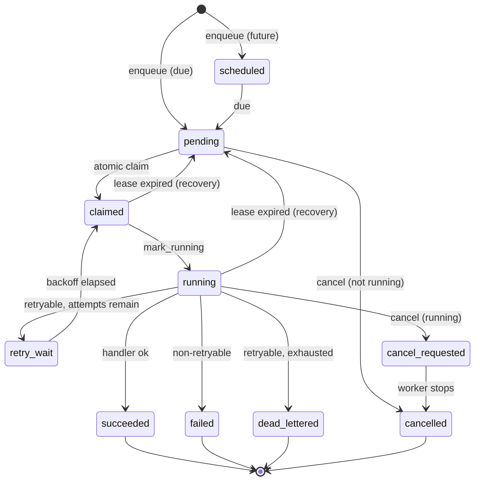

# Phase 3A.3 — Durable Job Execution Foundation

Third vertical slice of Phase 3. It turns the previously **synchronous, in-request**
scout run into a durable, auditable, crash-safe background job processed by a separate
worker. Everything is additive behind the existing configuration and adapter seams:
default local mode still runs with **zero external services and no paid providers**, and
the Phase 1–2 / 3A.1 / 3A.2 behaviour — including the four-market isolation guarantee — is
unchanged.

Delivery is **at-least-once with idempotency controls**, never exactly-once: a job may run
more than once (e.g. a worker dies after doing work but before recording success), so every
handler must be safe to re-run.

## What shipped

| Area | File(s) | Summary |
| --- | --- | --- |
| Status + error contracts | `app/jobs/status.py` | `JobStatus` lifecycle with an **explicit** transition map (terminal states never revert); `JobType`; `JobErrorCode` taxonomy that decides retryability; bounded, secret-free `JobError`. |
| Backoff | `app/jobs/backoff.py` | Pure, deterministic, **bounded** exponential backoff with seeded partial jitter. |
| Models + migration | `app/jobs/models.py`, `alembic/versions/dacbf2b1e915_*.py` | `jobs` (tenant-scoped work, versioned payload, lease/attempt bookkeeping, safe outcome) + append-only `job_events` audit trail. Portable across SQLite/PostgreSQL. |
| Durable store / queue | `app/jobs/store.py` | DB-backed queue: tenant-scoped idempotency; **SQLite-safe atomic claim** (compare-and-set `UPDATE … WHERE status=<observed>`, no `SKIP LOCKED`); leases + heartbeats; running→success/retry/dead-letter/cancel; expired-lease recovery (the at-least-once safety net). All times UTC and clock-injectable. |
| Enqueue service | `app/jobs/service.py` | The seam callers use. Rejects an unknown job type (`UNSUPPORTED_TYPE`) and an oversized payload (`PAYLOAD_TOO_LARGE`) **before** enqueue; derives `payload_hash` from the versioned `JobEnvelope`. |
| Handler registry | `app/jobs/registry.py`, `app/jobs/handlers.py` | Typed `register_handler` / `resolve_handler`; the `scout_request.execute` handler runs the existing pipeline. Separate from the legacy in-process queue registry. |
| Worker | `app/jobs/worker.py` | Separate-process worker (`python -m app.jobs.worker` / `npm run worker`): unique id, startup validation, bounded polling, lease recovery, atomic claim, heartbeat thread, cooperative cancellation, and **graceful signal-driven drain**. Never auto-started inside FastAPI. |
| Scout integration | `app/scouting_requests/routes.py` | The run endpoint is now **non-blocking**: it atomically guards status (`draft/completed → queued`) and enqueues a job, returning `status=queued` + `{job_id, job_status}` instead of synchronous stats. |
| Customer API | `app/jobs/routes.py`, `app/jobs/schemas.py` | Workspace-scoped `GET …/jobs`, `…/jobs/{id}`, `…/jobs/{id}/events`, and `POST …/jobs/{id}/cancel`. The customer view is lifecycle + outcome only — **no** worker id, lease/heartbeat values, raw payload, payload hash, idempotency key, or raw error. |
| Operator diagnostics | `app/system/internal_routes.py` | Operator-only `GET /internal/system/jobs`: cross-tenant status counts + recent jobs with safe worker/lease detail (still never a raw payload or secret). |
| Runtime + readiness | `app/core/runtime.py`, `app/system/probes.py` | A `durable_queue` capability and a bounded `durable_queue` readiness probe (verifies the schema is present; never touches a payload). |
| Frontend | `apps/web/src/pages/scouts/JobsPanel.tsx` (+ typed client, labels, badge) | A read-only **Background jobs** panel on the scout-request detail that polls while a job is in flight (the run is now async) and offers a customer-safe cancel. |
| Worker script | `scripts/run-worker.sh`, `package.json` (`npm run worker`) | Convenience entrypoint that reuses the venv guard. |

## Security & isolation properties (enforced, and covered by tests)

- **Tenant isolation travels with the row.** The worker rebuilds `ExecutionContext` from the
  **persisted job columns**, never from the transported message, so a tampered/stale message
  body cannot widen a job's scope. Customer reads are scoped by `organization_id` +
  `workspace_id`; a cross-tenant `get_job` returns `None`.
- **Two disclosure tiers.** `JobOut`/`JobEventOut` are customer-safe (lifecycle + outcome).
  Worker ids, lease/heartbeat/claim timestamps, payload hash and raw error summary live only
  on the operator `JobOperatorOut`; **no** tier ever carries the raw payload or a secret.
- **No secret leakage on failure.** An unclassified exception escaping a handler is recorded
  as a conservative retryable `transient` failure carrying only the exception **class name** —
  never its message (which may contain customer content or secrets).
- **Exactly one worker per job.** The compare-and-set claim guarantees a single winner even
  under concurrency; a lost race simply scans the next candidate.
- **Operator gate.** `/internal/system/jobs` is `401` anonymous, `403` for an authenticated
  non-operator, and detailed-but-secret-free for an operator.

## Delivery & lifecycle semantics

- **At-least-once.** A crashed worker's lease expires and `recover_expired_leases` returns the
  job to the queue (an audited replay) or dead-letters it once attempts are exhausted.
- **Bounded retries + backoff.** A retryable failure with attempts remaining goes to
  `retry_wait` with a computed delay; a non-retryable failure fails fast; an exhausted
  retryable failure dead-letters.
- **Cooperative cancellation.** A not-yet-running job cancels immediately; a running job is
  marked `cancel_requested` and stopped by the worker at its next safe point.
- **Deterministic in tests.** Every lifecycle method takes an injected `now`, and backoff is
  seeded, so schedules are asserted exactly.

## Running it locally

```bash
npm run demo:setup           # migrate + seed (creates the jobs/job_events tables)
npm run dev                  # FastAPI (SQLite) + web
npm run worker               # in a second terminal: process durable jobs
```

Trigger a scout run from the UI (or `POST …/scout-requests/{id}/run`); it returns
immediately with `status=queued`. The **Background jobs** panel polls the job to a terminal
state, and opportunities appear as the worker completes the pipeline. Without a running
worker the job simply stays `pending` — nothing is lost.

## Configuration

All settings are additive with safe local defaults (see `app/core/config.py`):

| Setting | Default | Purpose |
| --- | --- | --- |
| `JOB_QUEUE_BACKEND` | `local` | Durable queue backend (only `local` is implemented in this build). |
| `WORKER_ID` | derived | Stable-if-set, otherwise `host-pid-token`. |
| `WORKER_CONCURRENCY` | `1` | Identical worker threads (each with its own session). |
| `WORKER_POLL_INTERVAL_SECONDS` | `1.0` | Idle poll interval (bounded wait, never a busy-spin). |
| `WORKER_LEASE_SECONDS` | `30.0` | Lease duration a claiming worker holds. |
| `WORKER_HEARTBEAT_SECONDS` | `10.0` | Heartbeat interval (must be `< lease`). |
| `WORKER_SHUTDOWN_GRACE_SECONDS` | `10.0` | Drain window for in-flight work on shutdown. |
| `JOB_DEFAULT_MAX_ATTEMPTS` | `5` | Default attempt budget per job. |
| `JOB_RETRY_BASE_SECONDS` | `2.0` | Backoff base. |
| `JOB_RETRY_MAX_SECONDS` | `300.0` | Backoff cap (`≥ base`). |
| `JOB_MAX_PAYLOAD_BYTES` | `65536` | Enqueue payload-size bound. |
| `JOB_CLAIM_BATCH_SIZE` | `1` | Claim scan sizing. |
| `READINESS_CACHE_TTL_SECONDS` | `0.0` | Optional readiness cache TTL. |

Startup validation rejects incoherent combinations (non-positive intervals, heartbeat ≥ lease,
`retry_max < retry_base`, etc.).

## Lifecycle state diagram



## Out of scope (Phase 3B and later)

Live queue/worker infrastructure (Redis/Celery/Temporal/SQS/etc.), real connectors, creative
generation, scheduling UI, and cross-worker distributed coordination beyond the single-process
model. This slice is deliberately local-first and deterministic.

## Rollback plan

- The only schema change is the additive `jobs` + `job_events` migration (`dacbf2b1e915`); it
  has a tested `downgrade`, and no existing table is altered.
- Revert = revert the single squash commit for this PR, then `alembic downgrade` one step if
  the tables must be removed. Local `main` returns to the accepted baseline with no manual data
  repair.
