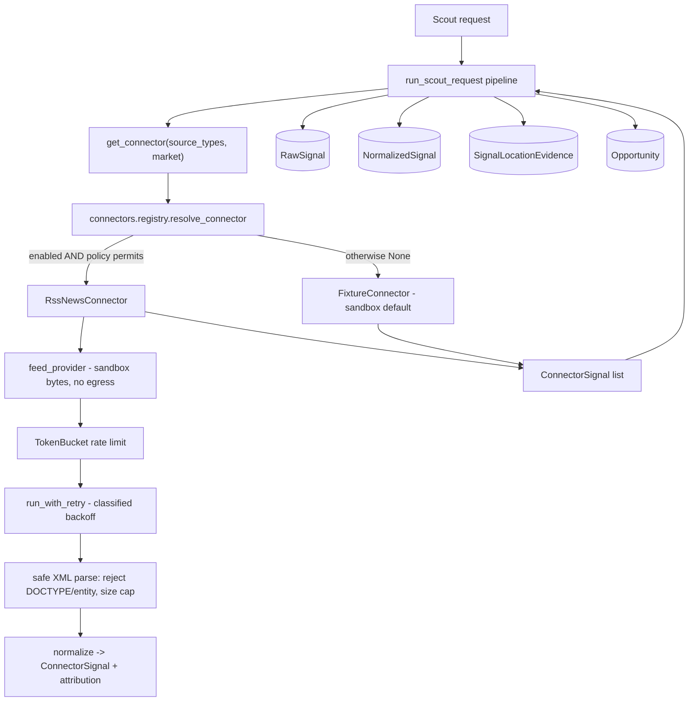

# Phase 3B — First real scouting connector: implementation plan

**Status: Batch 1 (connector foundation + RSS sandbox connector) — DRAFT for owner review.**

_Independent-review status: NO INDEPENDENT THIRD-PARTY REVIEW COMPLETED._

## 1. Executive summary

Phase 3A delivered the production data plane (PostgreSQL / Redis / S3 adapters,
durable job worker + fleet registry, observability, deployment). The scouting
pipeline is complete and production-shaped, but it still ingests **simulated
fixtures** through the `Connector` seam. Phase 3B replaces that seam's default
with the first **real** scouting connector, end to end: source connection →
ingestion → normalization → evidence storage → opportunity creation → per-location
isolation → UI display → full tests (`docs/phase-3-plan.md` Phase 3B).

This batch (Batch 1) delivers the **connector-agnostic foundation** every source
must satisfy plus the **first concrete connector (RSS / news feeds) in a
deterministic sandbox** (no live network egress). It is fully additive and inert
by default: the fixture path stays authoritative until a product owner enables a
specific connector. Live egress, feed hardening against untrusted input, and the
frontend surface are explicitly deferred to later batches, gated on owner
approval and connector legal sign-off.

## 2. Scope evidence and classification

| # | Source | What it establishes | Authority |
|---|--------|---------------------|-----------|
| E1 | `docs/phase-3-plan.md` §"Phase 3B" | "First real scouting connector / Choose **one** legally accessible, high-value connector." Deliverables: source connection, ingestion, normalization, evidence storage, opportunity creation, location isolation, UI display, full tests. "Do not begin with every social network simultaneously." | **Authoritative** |
| E2 | `docs/phase-3-plan.md` Workstream A | Per-connector non-negotiables: legal/policy review, rate limiting, credential isolation, source attribution, retry/backoff, failure classification, data-retention, jurisdiction filters, per-location isolation, mock/sandbox. Disclaims unrestricted scraping. | **Authoritative** |
| E3 | `docs/phase-3-plan.md` Phase 3 entry criteria | "Product owner approves the first Phase 3 vertical slice"; "Connector policy and legal feasibility confirmed"; acceptance criteria + data-isolation tests + rollback + cost limits. | **Authoritative** |
| E4 | `apps/api/app/scouting_requests/connectors.py` | The `Connector` seam + default `FixtureConnector` already exist; docstring anticipates live connectors. | Supporting (code) |
| E5 | `apps/api/app/core/enums.py` `SourceType` | `rss_news`, `website_scan`, `reddit`, `reviews`, `google_trends`, `meta_ad_library`, … already defined; the pipeline already handles `rss_news` items. | Supporting (code) |

**Classification: PARTIALLY DEFINED.** The phase's objective, boundaries,
deliverables, operational contract, dependencies and exclusions are DEFINED. The
one open, owner-gated parameter is **which** connector (E3). Per the Phase 3B
plan-of-record, that decision requires product-owner approval and confirmed legal
feasibility before live egress.

**Recommended first connector: RSS / news feeds (`rss_news`).** Repository-backed
rationale: named in Workstream A as a first-tier public source; `SourceType.RSS_NEWS`
already flows through the pipeline; RSS is publisher-syndicated content with
explicit intent to distribute — the lowest ToS/legal risk of the candidates,
best satisfying "legally accessible"; needs no per-user credentials; fully
deterministic to sandbox. Website crawl is second (robots/ToS complexity); social
APIs need credentials + heavier policy review.

## 3. In scope / out of scope

**In scope (Batch 1):**
- Connector foundation package `app/connectors/`: signal contract, base class,
  failure classification, token-bucket rate limiter, bounded retry/backoff,
  enablement + jurisdiction policy, registry.
- RSS/news connector: parse → normalize → source attribution, market-scoped,
  keyword-filtered, running on a bundled **deterministic sandbox feed**.
- Config flags (all off/bounded by default) and registry wiring so the connector
  is selected **only** when explicitly enabled and policy-permitted.
- Full unit tests; all existing gates preserved.

**Out of scope (later batches, owner-gated):**
- Live network egress / a real HTTP feed provider (Batch 2).
- Hardened parsing of untrusted remote feeds (e.g. `defusedxml`, per-host
  allowlists, content-type/size enforcement on live responses) (Batch 2).
- Persisted per-connector run metadata / cost accounting surfaced to operators.
- Frontend display of connector source + attribution on opportunities (Batch 3).
- Any second connector (Reddit, reviews, website crawl, …).

## 4. Current-state assessment

| Component | State | Batch-1 action |
|-----------|-------|----------------|
| `Connector` Protocol + `FixtureConnector` | Exists; simulated only | Reuse; resolve via registry; fixture stays default |
| Pipeline `run_scout_request` (`app/jobs/pipeline.py`) | Production-ready; per-tenant/location scoped | Reuse; pass scope to `get_connector`; default path unchanged |
| `RawSignal` / `NormalizedSignal` / `SignalLocationEvidence` | Production-ready evidence storage | Reuse; no schema change in Batch 1 |
| Connector operational contract (rate limit, retry, failure class., attribution, sandbox) | **Missing** | Build `app/connectors/` |
| `SourceType` vocabulary incl. `rss_news` | Exists end-to-end | Reuse |
| Live egress | `httpx` present; unused by connectors | Not wired (owner-gated) |

## 5. Architecture

The connector is a drop-in at the existing seam: `get_connector` returns a live
connector only when enabled + permitted, else the fixture connector. The pipeline
downstream is unchanged.

## 6. Data model

No schema change in Batch 1. Connector output normalizes into the existing
`raw_signals` / `normalized_signals` / `signal_location_evidence` tables via the
unchanged pipeline. `ConnectorSignal.attribution` (connector name, source title,
source URL, retrieved-at, license) is carried in the signal and lands in existing
`raw_metadata` / `ingest_metadata` JSON when a live connector is enabled — no
migration required. A dedicated attribution/run table, if wanted, is a later
batch.

## 7. API and contract

No new endpoints or schemas; `apps/api/openapi.json` and the generated frontend
types are unchanged (verified: zero contract drift). Connector selection is
internal to the pipeline and governed by configuration, not request input.

## 8. Frontend

No change in Batch 1. Displaying connector source + attribution on opportunity
detail is Batch 3, behind the generated contract.

## 9. Worker

No change to durable job execution. The connector runs inside the existing
`run_scout_request` job body, so at-least-once delivery, idempotency, leasing and
isolation guarantees carry over unchanged. The rate limiter/retry are per-run and
in-process; no new background thread.

## 10. Security and privacy

- **Off by default.** `connector_rss_enabled=False`; a live source never runs
  implicitly. Enabling is a bounded, validated config decision.
- **Isolation preserved.** A connector receives only a `FetchScope` (market,
  keywords, source types, cap) and must return in-market signals; the pipeline's
  tenant/workspace/location guards are unchanged. Market isolation is unit-tested.
- **No secret leakage.** Connectors carry no credentials in Batch 1; attribution
  stores only non-secret provenance. Failures are classified into a coarse,
  secret-free taxonomy — no raw driver/parse text is surfaced.
- **XML safety.** The parser rejects any feed declaring a DOCTYPE/entity
  (defusing billion-laughs / XXE) and caps input size before parsing.
- **No fabricated commercial signal.** Fields a public source cannot observe
  (engagement, buying intent, ad activity) default to neutral.
- **Nothing simulated presented as real.** Sandbox signals keep `is_simulated=True`.

## 11. Testing

`app/tests/test_connectors.py` (25 tests, all offline): rate-limiter token math
+ refill; retry backoff bounds, retry-only-transient, give-up-at-cap; failure
classification; policy enablement + jurisdiction; RSS parse/normalize/attribution;
**market isolation**; keyword filter; DOCTYPE/malformed/size rejection; network +
rate-limit classification; registry enable/disable/jurisdiction; seam default →
fixture and enabled → live; and a contract test locking every pipeline-read
attribute on `ConnectorSignal`. All prior suites, ruff, migration check, contract
drift, npm audit, frontend gates and the four-market smoke remain green.

## 12. Rollout

Additive and inert. No migration. To trial the live path later: set
`connector_rss_enabled=true` (optionally `connector_rss_markets`) in a non-prod
environment **after** a live feed provider lands in Batch 2 and legal feasibility
is confirmed. **Rollback:** set the flag back to false (instant revert to the
fixture path) or revert the branch — no schema or data changes to undo.

## 13. Batch plan

- **Batch 1 (this PR):** connector foundation + RSS sandbox connector + tests. No
  egress, no UI, no migration. Draft PR = owner checkpoint for connector choice +
  legal feasibility.
- **Batch 2:** live HTTP feed provider behind config; hardened untrusted-feed
  parsing; per-host allowlist + cost/rate ceilings; integration smoke against a
  local sandbox feed server; run/attribution persistence.
- **Batch 3 (signal intelligence — this section 16):** additive, fully deterministic,
  offline signal-intelligence core (extraction → business relevance → versioned
  opportunity scoring → structured accept/reject) reusing the existing scoring
  engines. Orthogonal to the connector-attribution *frontend* work, which remains a
  later, separately-gated UI batch.
- **Later:** additional connectors (one at a time), each with its own policy/legal
  review; frontend surface for connector source + attribution on opportunities.

## 14. Acceptance criteria (Batch 1)

1. Connector foundation exists with rate limiting, bounded retry/backoff, failure
   classification, enablement + jurisdiction policy, and a registry. ✅
2. RSS connector parses → normalizes → attributes a feed, market-scoped, offline. ✅
3. Default behaviour is byte-identical (fixture path); four-market smoke unchanged. ✅
4. No live egress; XML parsing rejects DOCTYPE/entity + oversize input. ✅
5. No schema change, no contract drift, no new API surface. ✅
6. All gates green: backend + new tests, ruff, migration check, contract gen,
   npm audit, frontend lint/type-check/tests, integration smoke. ✅

## 15. Risk register

| ID | Risk | Likelihood | Impact | Mitigation | Disposition |
|----|------|-----------|--------|------------|-------------|
| B-1 | Connector choice not yet owner-approved | — | Med | Batch 1 ships only the foundation + sandbox; live egress deferred to Batch 2 behind approval; draft PR is the checkpoint | Open — needs owner sign-off |
| B-2 | Live feed parsing of untrusted input could enable XXE/billion-laughs | Low | High | DOCTYPE/entity rejection + size cap now; `defusedxml` + hardening planned for Batch 2 before any egress | Mitigated (Batch 1) / Deferred (Batch 2) |
| B-3 | A connector could blend markets | Low | High | Connector receives only a scoped `FetchScope`; market isolation unit-tested; pipeline guards unchanged | Mitigated |
| B-4 | Enabling a live source without rate control → source abuse / cost | Low | Med | Token-bucket rate limit + bounded retry mandatory; flags validated at construction; live provider gated | Mitigated |
| B-5 | Fabricated commercial signal from a public source | Low | Med | Neutral defaults for unobservable fields; `is_simulated` honoured | Mitigated |
| B-6 | Regression to the existing fixture pipeline | Low | High | Additive; default path unchanged; full suite + smoke green | Mitigated |
| B-7 | Legal/ToS feasibility of RSS not formally confirmed | — | Med | Recommendation documented; formal confirmation is a Phase 3 entry criterion owned by the product owner | Open — needs legal sign-off |

## 16. Batch 3 — Signal intelligence and opportunity scoring

**Status: Batch 3 (signal-intelligence core) — DRAFT.** Additive to the Phase 2
pipeline; no schema change, no contract change, no live egress, no dependency on
the Batch 2 live-connector branch (PR #34).

_Independent-review status: NO INDEPENDENT THIRD-PARTY REVIEW COMPLETED._

### 16.1 Classification: PARTIALLY DEFINED

A rich Phase 2 pipeline already scores opportunities (`app/jobs/pipeline.py` +
`app/scoring/*`). What is **not** yet defined is a deterministic, offline
*intelligence layer* that (a) separates observed **facts** from **inference**
with evidence spans, (b) versions its scoring, (c) emits **structured** accept/
reject reason codes, and (d) runs with **no** model call. Per the plan-of-record
rule "implement only the supported foundation; do not invent an unrelated Batch 3",
this section adds exactly that foundation and reuses — never replaces — the
existing relevance/validation/decision engines.

### 16.2 Objective

Transform a normalized, market-scoped signal into an explainable, evidence-backed
`OpportunityCandidate` through a deterministic chain:
`enrich → extract facts + intelligence → business relevance → versioned scoring →
structured accept/reject → deterministic clustering`. Identical input always
produces identical output; no untrusted content is ever executed or trusted.

### 16.3 What exists / is missing

| Concern | Phase 2 today | Batch 3 addition |
|---------|---------------|------------------|
| Signal typing | LLM-only (`classify_signal`) | Deterministic, offline extractor (no model call) |
| Facts vs inference | Mixed on `Opportunity` | Typed `SignalFacts` (literal) vs `ExtractedIntelligence` (inference + evidence spans + method + confidence) |
| Scoring version | none | `SCORING_VERSION` stamp on every breakdown |
| Rejections | silent `continue` | `RejectionReason` enum + structured, explainable reasons |
| Enrichment provider | n/a | Provider-neutral boundary: deterministic default, AI adapter **disabled**, offline in tests |
| Clustering | empty `app/clustering/` | Deterministic key-based clustering with stable ids |
| Evaluation | none | Labeled dataset with expected outcomes, asserted in tests |

### 16.4 Domain models (`app/intelligence/models.py`)

- `SignalFacts` — only what is literally present (source_type, market, author,
  language, published_days_ago, char/word counts, raw excerpt). No inference.
- `EvidenceSpan` — `(start, end, quote)` into the *sanitized* excerpt, plus the
  extraction `method`. Every inferred attribute references ≥1 span.
- `ExtractedIntelligence` — inferred signal_type, pain-point DNA, sentiment,
  buying-intent / competitor-dissatisfaction flags, each with `evidence` spans,
  `method`, and a 0..1 `confidence`. Never conflated with facts.
- `BusinessRelevance` — relevance score (reuses `score_relevance`), matched
  keyword/pain/audience/competitor hits, exclusion hits, `below_action_floor`.
- `OpportunityCandidate` — the batch's output: facts, intelligence, relevance,
  the versioned `IntelligenceScore`, the `decision` (accept) or `RejectionReason`
  (reject), a human rationale, and the cluster key. Carries `is_simulated`.

### 16.5 Provider-neutral enrichment boundary (`app/intelligence/enrichment.py`)

An `Enricher` protocol with two implementations: `DeterministicEnricher`
(default; pure functions, offline) and a disabled `ModelEnricher` stub that
**raises** unless an explicit, non-default, non-test opt-in is set — so no
customer/source text can reach an external model in normal operation or CI.
Selection mirrors the LLM-service pattern (config-driven, safe default).

### 16.6 Deterministic extraction (`app/intelligence/extraction.py`)

Keyword/lexicon and regex matchers over the **sanitized** excerpt. Untrusted-
content safety: prompt-injection markers are defanged (quoted, never obeyed) and
control characters stripped before any span is recorded — identical to the Batch 2
neutralization discipline but applied to extracted quotes. No `eval`, no network,
no model.

### 16.7 Versioned scoring (`app/intelligence/scoring.py`)

`SCORING_VERSION = "3b.1"`. Composite 0..100 from eight clamped factors, each
carried with `{weight, value, points}`:

| Factor | Weight |
|--------|-------:|
| source_quality | 15 |
| recency | 10 |
| evidence_strength | 20 |
| urgency | 10 |
| business_fit | 20 |
| market_fit | 10 |
| commercial_usefulness | 10 |
| confidence | 5 |

Inputs reuse `_SOURCE_CREDIBILITY`, the relevance action-floor (40), cross-source
`score_validation`, and geo in-area. The breakdown embeds `version` so a stored
score is always interpretable against the formula that produced it.

### 16.8 Rejection / suppression (`app/intelligence/rejection.py`)

`RejectionReason` (new enum, additive): `NOISE`, `OUT_OF_CONTEXT`, `OUT_OF_MARKET`,
`DUPLICATE`, `INSUFFICIENT_EVIDENCE`, `POLICY_BLOCKED`, `WEAK_SIGNAL`. Rules are
ordered and short-circuit; each returns a structured reason + rationale so a
suppressed signal is as explainable as an accepted one.

### 16.9 Deterministic clustering (`app/intelligence/clustering.py`)

Stable cluster key = pain-point DNA → else signal type → else `"general"`, with a
deterministic content-hash tiebreak. No embeddings, no randomness; the same set
of candidates always clusters identically.

### 16.10 Migration / API / frontend / pipeline

- **Migration: NONE.** Pure/in-memory; results ride existing `ingest_metadata`
  JSON. A dedicated `signal_intelligence` table is a documented deferred decision.
- **API: no contract change.** No route/schema edits; `openapi.json` untouched.
- **Frontend: none.** Deferred.
- **Pipeline: additive only.** `analyze_signal` is attached to
  `NormalizedSignal.ingest_metadata["intelligence"]` behind a default-safe call;
  existing outputs, scores and decisions are byte-identical. If any existing test
  would change, the wiring is withheld and the core ships standalone.

### 16.11 Testing + evaluation

`app/tests/test_signal_intelligence.py` (unit: facts/inference separation,
extraction determinism, injection defanging, versioned scoring bounds + factor
math, every rejection reason, clustering stability) and
`app/tests/test_intelligence_evaluation.py` (asserts the labeled dataset in
`app/intelligence/evaluation/` reproduces expected accept/reject + band exactly).
All prior suites, ruff, migration check, contract drift, npm audit, frontend gates
and the four-market smoke stay green.

### 16.12 Rollback

`main` @ `fe78b39`. Every commit additive; no migration, no contract change —
reverting the branch (or simply not merging the draft PR) fully restores current
behavior.
