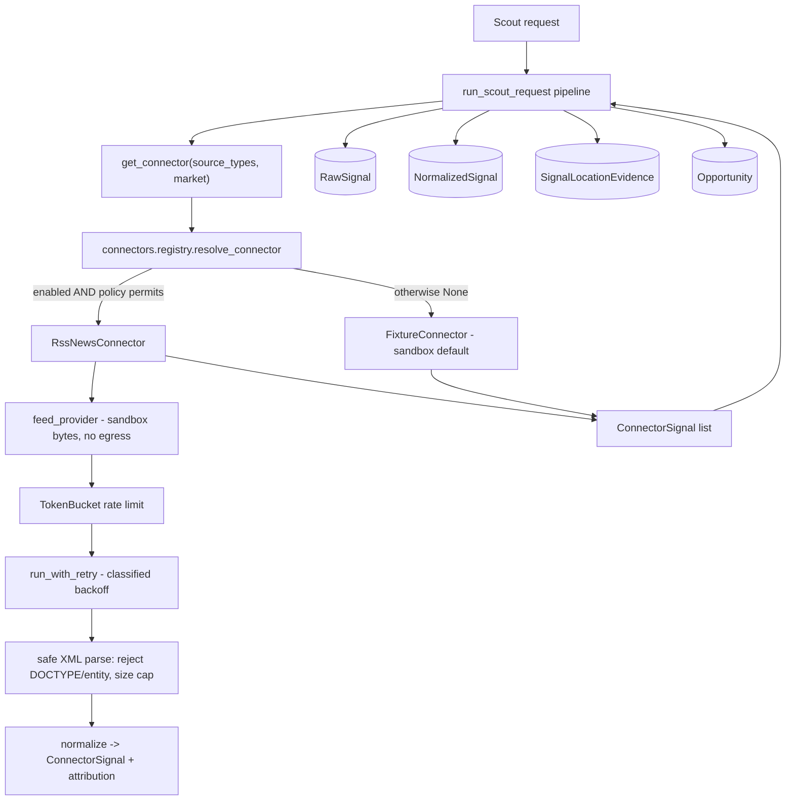

# Phase 3B — First real scouting connector: implementation plan

**Status: Batch 1 (connector foundation + RSS sandbox connector) — DRAFT for owner review.**

_Independent-review status: NO INDEPENDENT THIRD-PARTY REVIEW COMPLETED._

## 1. Executive summary

Phase 3A delivered the production data plane (PostgreSQL / Redis / S3 adapters,
durable job worker + fleet registry, observability, deployment). The scouting
pipeline is complete and production-shaped, but it still ingests **simulated
fixtures** through the `Connector` seam. Phase 3B replaces that seam's default
with the first **real** scouting connector, end to end: source connection →
ingestion → normalization → evidence storage → opportunity creation → per-location
isolation → UI display → full tests (`docs/phase-3-plan.md` Phase 3B).

This batch (Batch 1) delivers the **connector-agnostic foundation** every source
must satisfy plus the **first concrete connector (RSS / news feeds) in a
deterministic sandbox** (no live network egress). It is fully additive and inert
by default: the fixture path stays authoritative until a product owner enables a
specific connector. Live egress, feed hardening against untrusted input, and the
frontend surface are explicitly deferred to later batches, gated on owner
approval and connector legal sign-off.

## 2. Scope evidence and classification

| # | Source | What it establishes | Authority |
|---|--------|---------------------|-----------|
| E1 | `docs/phase-3-plan.md` §"Phase 3B" | "First real scouting connector / Choose **one** legally accessible, high-value connector." Deliverables: source connection, ingestion, normalization, evidence storage, opportunity creation, location isolation, UI display, full tests. "Do not begin with every social network simultaneously." | **Authoritative** |
| E2 | `docs/phase-3-plan.md` Workstream A | Per-connector non-negotiables: legal/policy review, rate limiting, credential isolation, source attribution, retry/backoff, failure classification, data-retention, jurisdiction filters, per-location isolation, mock/sandbox. Disclaims unrestricted scraping. | **Authoritative** |
| E3 | `docs/phase-3-plan.md` Phase 3 entry criteria | "Product owner approves the first Phase 3 vertical slice"; "Connector policy and legal feasibility confirmed"; acceptance criteria + data-isolation tests + rollback + cost limits. | **Authoritative** |
| E4 | `apps/api/app/scouting_requests/connectors.py` | The `Connector` seam + default `FixtureConnector` already exist; docstring anticipates live connectors. | Supporting (code) |
| E5 | `apps/api/app/core/enums.py` `SourceType` | `rss_news`, `website_scan`, `reddit`, `reviews`, `google_trends`, `meta_ad_library`, … already defined; the pipeline already handles `rss_news` items. | Supporting (code) |

**Classification: PARTIALLY DEFINED.** The phase's objective, boundaries,
deliverables, operational contract, dependencies and exclusions are DEFINED. The
one open, owner-gated parameter is **which** connector (E3). Per the Phase 3B
plan-of-record, that decision requires product-owner approval and confirmed legal
feasibility before live egress.

**Recommended first connector: RSS / news feeds (`rss_news`).** Repository-backed
rationale: named in Workstream A as a first-tier public source; `SourceType.RSS_NEWS`
already flows through the pipeline; RSS is publisher-syndicated content with
explicit intent to distribute — the lowest ToS/legal risk of the candidates,
best satisfying "legally accessible"; needs no per-user credentials; fully
deterministic to sandbox. Website crawl is second (robots/ToS complexity); social
APIs need credentials + heavier policy review.

## 3. In scope / out of scope

**In scope (Batch 1):**
- Connector foundation package `app/connectors/`: signal contract, base class,
  failure classification, token-bucket rate limiter, bounded retry/backoff,
  enablement + jurisdiction policy, registry.
- RSS/news connector: parse → normalize → source attribution, market-scoped,
  keyword-filtered, running on a bundled **deterministic sandbox feed**.
- Config flags (all off/bounded by default) and registry wiring so the connector
  is selected **only** when explicitly enabled and policy-permitted.
- Full unit tests; all existing gates preserved.

**Out of scope (later batches, owner-gated):**
- Live network egress / a real HTTP feed provider (Batch 2).
- Hardened parsing of untrusted remote feeds (e.g. `defusedxml`, per-host
  allowlists, content-type/size enforcement on live responses) (Batch 2).
- Persisted per-connector run metadata / cost accounting surfaced to operators.
- Frontend display of connector source + attribution on opportunities (Batch 3).
- Any second connector (Reddit, reviews, website crawl, …).

## 4. Current-state assessment

| Component | State | Batch-1 action |
|-----------|-------|----------------|
| `Connector` Protocol + `FixtureConnector` | Exists; simulated only | Reuse; resolve via registry; fixture stays default |
| Pipeline `run_scout_request` (`app/jobs/pipeline.py`) | Production-ready; per-tenant/location scoped | Reuse; pass scope to `get_connector`; default path unchanged |
| `RawSignal` / `NormalizedSignal` / `SignalLocationEvidence` | Production-ready evidence storage | Reuse; no schema change in Batch 1 |
| Connector operational contract (rate limit, retry, failure class., attribution, sandbox) | **Missing** | Build `app/connectors/` |
| `SourceType` vocabulary incl. `rss_news` | Exists end-to-end | Reuse |
| Live egress | `httpx` present; unused by connectors | Not wired (owner-gated) |

## 5. Architecture



The connector is a drop-in at the existing seam: `get_connector` returns a live
connector only when enabled + permitted, else the fixture connector. The pipeline
downstream is unchanged.

## 6. Data model

No schema change in Batch 1. Connector output normalizes into the existing
`raw_signals` / `normalized_signals` / `signal_location_evidence` tables via the
unchanged pipeline. `ConnectorSignal.attribution` (connector name, source title,
source URL, retrieved-at, license) is carried in the signal and lands in existing
`raw_metadata` / `ingest_metadata` JSON when a live connector is enabled — no
migration required. A dedicated attribution/run table, if wanted, is a later
batch.

## 7. API and contract

No new endpoints or schemas; `apps/api/openapi.json` and the generated frontend
types are unchanged (verified: zero contract drift). Connector selection is
internal to the pipeline and governed by configuration, not request input.

## 8. Frontend

No change in Batch 1. Displaying connector source + attribution on opportunity
detail is Batch 3, behind the generated contract.

## 9. Worker

No change to durable job execution. The connector runs inside the existing
`run_scout_request` job body, so at-least-once delivery, idempotency, leasing and
isolation guarantees carry over unchanged. The rate limiter/retry are per-run and
in-process; no new background thread.

## 10. Security and privacy

- **Off by default.** `connector_rss_enabled=False`; a live source never runs
  implicitly. Enabling is a bounded, validated config decision.
- **Isolation preserved.** A connector receives only a `FetchScope` (market,
  keywords, source types, cap) and must return in-market signals; the pipeline's
  tenant/workspace/location guards are unchanged. Market isolation is unit-tested.
- **No secret leakage.** Connectors carry no credentials in Batch 1; attribution
  stores only non-secret provenance. Failures are classified into a coarse,
  secret-free taxonomy — no raw driver/parse text is surfaced.
- **XML safety.** The parser rejects any feed declaring a DOCTYPE/entity
  (defusing billion-laughs / XXE) and caps input size before parsing.
- **No fabricated commercial signal.** Fields a public source cannot observe
  (engagement, buying intent, ad activity) default to neutral.
- **Nothing simulated presented as real.** Sandbox signals keep `is_simulated=True`.

## 11. Testing

`app/tests/test_connectors.py` (25 tests, all offline): rate-limiter token math
+ refill; retry backoff bounds, retry-only-transient, give-up-at-cap; failure
classification; policy enablement + jurisdiction; RSS parse/normalize/attribution;
**market isolation**; keyword filter; DOCTYPE/malformed/size rejection; network +
rate-limit classification; registry enable/disable/jurisdiction; seam default →
fixture and enabled → live; and a contract test locking every pipeline-read
attribute on `ConnectorSignal`. All prior suites, ruff, migration check, contract
drift, npm audit, frontend gates and the four-market smoke remain green.

## 12. Rollout

Additive and inert. No migration. To trial the live path later: set
`connector_rss_enabled=true` (optionally `connector_rss_markets`) in a non-prod
environment **after** a live feed provider lands in Batch 2 and legal feasibility
is confirmed. **Rollback:** set the flag back to false (instant revert to the
fixture path) or revert the branch — no schema or data changes to undo.

## 13. Batch plan

- **Batch 1 (this PR):** connector foundation + RSS sandbox connector + tests. No
  egress, no UI, no migration. Draft PR = owner checkpoint for connector choice +
  legal feasibility.
- **Batch 2:** live HTTP feed provider behind config; hardened untrusted-feed
  parsing; per-host allowlist + cost/rate ceilings; integration smoke against a
  local sandbox feed server; run/attribution persistence.
- **Batch 3 (signal intelligence — this section 16):** additive, fully deterministic,
  offline signal-intelligence core (extraction → business relevance → versioned
  opportunity scoring → structured accept/reject) reusing the existing scoring
  engines. Orthogonal to the connector-attribution *frontend* work, which remains a
  later, separately-gated UI batch.
- **Later:** additional connectors (one at a time), each with its own policy/legal
  review; frontend surface for connector source + attribution on opportunities.

## 14. Acceptance criteria (Batch 1)

1. Connector foundation exists with rate limiting, bounded retry/backoff, failure
   classification, enablement + jurisdiction policy, and a registry. ✅
2. RSS connector parses → normalizes → attributes a feed, market-scoped, offline. ✅
3. Default behaviour is byte-identical (fixture path); four-market smoke unchanged. ✅
4. No live egress; XML parsing rejects DOCTYPE/entity + oversize input. ✅
5. No schema change, no contract drift, no new API surface. ✅
6. All gates green: backend + new tests, ruff, migration check, contract gen,
   npm audit, frontend lint/type-check/tests, integration smoke. ✅

## 15. Risk register

| ID | Risk | Likelihood | Impact | Mitigation | Disposition |
|----|------|-----------|--------|------------|-------------|
| B-1 | Connector choice not yet owner-approved | — | Med | Batch 1 ships only the foundation + sandbox; live egress deferred to Batch 2 behind approval; draft PR is the checkpoint | Open — needs owner sign-off |
| B-2 | Live feed parsing of untrusted input could enable XXE/billion-laughs | Low | High | DOCTYPE/entity rejection + size cap now; `defusedxml` + hardening planned for Batch 2 before any egress | Mitigated (Batch 1) / Deferred (Batch 2) |
| B-3 | A connector could blend markets | Low | High | Connector receives only a scoped `FetchScope`; market isolation unit-tested; pipeline guards unchanged | Mitigated |
| B-4 | Enabling a live source without rate control → source abuse / cost | Low | Med | Token-bucket rate limit + bounded retry mandatory; flags validated at construction; live provider gated | Mitigated |
| B-5 | Fabricated commercial signal from a public source | Low | Med | Neutral defaults for unobservable fields; `is_simulated` honoured | Mitigated |
| B-6 | Regression to the existing fixture pipeline | Low | High | Additive; default path unchanged; full suite + smoke green | Mitigated |
| B-7 | Legal/ToS feasibility of RSS not formally confirmed | — | Med | Recommendation documented; formal confirmation is a Phase 3 entry criterion owned by the product owner | Open — needs legal sign-off |

## 16. Batch 3 — Signal intelligence and opportunity scoring

**Status: Batch 3 (signal-intelligence core) — DRAFT.** Additive to the Phase 2
pipeline; no schema change, no contract change, no live egress, no dependency on
the Batch 2 live-connector branch (PR #34).

_Independent-review status: NO INDEPENDENT THIRD-PARTY REVIEW COMPLETED._

### 16.1 Classification: PARTIALLY DEFINED

A rich Phase 2 pipeline already scores opportunities (`app/jobs/pipeline.py` +
`app/scoring/*`). What is **not** yet defined is a deterministic, offline
*intelligence layer* that (a) separates observed **facts** from **inference**
with evidence spans, (b) versions its scoring, (c) emits **structured** accept/
reject reason codes, and (d) runs with **no** model call. Per the plan-of-record
rule "implement only the supported foundation; do not invent an unrelated Batch 3",
this section adds exactly that foundation and reuses — never replaces — the
existing relevance/validation/decision engines.

### 16.2 Objective

Transform a normalized, market-scoped signal into an explainable, evidence-backed
`OpportunityCandidate` through a deterministic chain:
`enrich → extract facts + intelligence → business relevance → versioned scoring →
structured accept/reject → deterministic clustering`. Identical input always
produces identical output; no untrusted content is ever executed or trusted.

### 16.3 What exists / is missing

| Concern | Phase 2 today | Batch 3 addition |
|---------|---------------|------------------|
| Signal typing | LLM-only (`classify_signal`) | Deterministic, offline extractor (no model call) |
| Facts vs inference | Mixed on `Opportunity` | Typed `SignalFacts` (literal) vs `ExtractedIntelligence` (inference + evidence spans + method + confidence) |
| Scoring version | none | `SCORING_VERSION` stamp on every breakdown |
| Rejections | silent `continue` | `RejectionReason` enum + structured, explainable reasons |
| Enrichment provider | n/a | Provider-neutral boundary: deterministic default, AI adapter **disabled**, offline in tests |
| Clustering | empty `app/clustering/` | Deterministic key-based clustering with stable ids |
| Evaluation | none | Labeled dataset with expected outcomes, asserted in tests |

### 16.4 Domain models (`app/intelligence/models.py`)

- `SignalFacts` — only what is literally present (source_type, market, author,
  language, published_days_ago, char/word counts, raw excerpt). No inference.
- `EvidenceSpan` — `(start, end, quote)` into the *sanitized* excerpt, plus the
  extraction `method`. Every inferred attribute references ≥1 span.
- `ExtractedIntelligence` — inferred signal_type, pain-point DNA, sentiment,
  buying-intent / competitor-dissatisfaction flags, each with `evidence` spans,
  `method`, and a 0..1 `confidence`. Never conflated with facts.
- `BusinessRelevance` — relevance score (reuses `score_relevance`), matched
  keyword/pain/audience/competitor hits, exclusion hits, `below_action_floor`.
- `OpportunityCandidate` — the batch's output: facts, intelligence, relevance,
  the versioned `IntelligenceScore`, the `decision` (accept) or `RejectionReason`
  (reject), a human rationale, and the cluster key. Carries `is_simulated`.

### 16.5 Provider-neutral enrichment boundary (`app/intelligence/enrichment.py`)

An `Enricher` protocol with two implementations: `DeterministicEnricher`
(default; pure functions, offline) and a disabled `ModelEnricher` stub that
**raises** unless an explicit, non-default, non-test opt-in is set — so no
customer/source text can reach an external model in normal operation or CI.
Selection mirrors the LLM-service pattern (config-driven, safe default).

### 16.6 Deterministic extraction (`app/intelligence/extraction.py`)

Keyword/lexicon and regex matchers over the **sanitized** excerpt. Untrusted-
content safety: prompt-injection markers are defanged (quoted, never obeyed) and
control characters stripped before any span is recorded — identical to the Batch 2
neutralization discipline but applied to extracted quotes. No `eval`, no network,
no model.

### 16.7 Versioned scoring (`app/intelligence/scoring.py`)

`SCORING_VERSION = "3b.1"`. Composite 0..100 from eight clamped factors, each
carried with `{weight, value, points}`:

| Factor | Weight |
|--------|-------:|
| source_quality | 15 |
| recency | 10 |
| evidence_strength | 20 |
| urgency | 10 |
| business_fit | 20 |
| market_fit | 10 |
| commercial_usefulness | 10 |
| confidence | 5 |

Inputs reuse `_SOURCE_CREDIBILITY`, the relevance action-floor (40), cross-source
`score_validation`, and geo in-area. The breakdown embeds `version` so a stored
score is always interpretable against the formula that produced it.

### 16.8 Rejection / suppression (`app/intelligence/rejection.py`)

`RejectionReason` (new enum, additive): `NOISE`, `OUT_OF_CONTEXT`, `OUT_OF_MARKET`,
`DUPLICATE`, `INSUFFICIENT_EVIDENCE`, `POLICY_BLOCKED`, `WEAK_SIGNAL`. Rules are
ordered and short-circuit; each returns a structured reason + rationale so a
suppressed signal is as explainable as an accepted one.

### 16.9 Deterministic clustering (`app/intelligence/clustering.py`)

Stable cluster key = pain-point DNA → else signal type → else `"general"`, with a
deterministic content-hash tiebreak. No embeddings, no randomness; the same set
of candidates always clusters identically.

### 16.10 Migration / API / frontend / pipeline

- **Migration: NONE.** Pure/in-memory; results ride existing `ingest_metadata`
  JSON. A dedicated `signal_intelligence` table is a documented deferred decision.
- **API: no contract change.** No route/schema edits; `openapi.json` untouched.
- **Frontend: none.** Deferred.
- **Pipeline: additive only.** `analyze_signal` is attached to
  `NormalizedSignal.ingest_metadata["intelligence"]` behind a default-safe call;
  existing outputs, scores and decisions are byte-identical. If any existing test
  would change, the wiring is withheld and the core ships standalone.

### 16.11 Testing + evaluation

`app/tests/test_signal_intelligence.py` (unit: facts/inference separation,
extraction determinism, injection defanging, versioned scoring bounds + factor
math, every rejection reason, clustering stability) and
`app/tests/test_intelligence_evaluation.py` (asserts the labeled dataset in
`app/intelligence/evaluation/` reproduces expected accept/reject + band exactly).
All prior suites, ruff, migration check, contract drift, npm audit, frontend gates
and the four-market smoke stay green.

### 16.12 Rollback

`main` @ `fe78b39`. Every commit additive; no migration, no contract change —
reverting the branch (or simply not merging the draft PR) fully restores current
behavior.

## 17. Batch 4 — Evidence-backed opportunity intelligence

### 17.1 Status

**Status:** BATCH 4 COMPLETE — BATCHES 4A–4D MERGED AND POST-MERGE VERIFIED

- The owner-approved Batch 4 **scope remains active**; this section is the
  implementation contract for the whole Batch 4 program.
- **Batch 4A (persistence foundation) is complete**: implemented, reviewed by the
  genuine reviewer, merged through normal branch protection, and post-merge verified
  (see §17.14 Batch 4A completion record). Merge commit
  `3795f54a6664a424d3678f100cb92f7d28b5cf89` (PR #37).
- **Batch 4B (read-only API exposure) is complete**: implemented, approved by the
  genuine reviewer, merged through normal branch protection, and post-merge verified
  (see §17.14 Batch 4B completion record). Squash merge commit
  `6aeb0c2177ef0f3a25a42bd46fd23cd71db09778` (PR #40).
- **Batch 4C (frontend intelligence panel) is complete**: implemented, approved by the
  genuine reviewer, merged through normal branch protection, and post-merge verified
  (see §17.14.3 completion record). Squash merge commit
  `1c579f17143de6e4aaf7fa8e36f42a4d3293c895` (PR #42).
- **Batch 4D (integration and closeout) is complete**: implemented, approved by the
  genuine reviewer `adesenden`, merged through normal branch protection, and post-merge
  verified (see §17.22.21 Batch 4D completion record). Squash merge commit
  `718485fc821b8865f513dae2ba36310cfb271c98` (PR #44). Overall Batch 4 is **complete**.
- Batch 4 is **independent of PR #34 and live egress** — neither the live-connector
  branch nor any network transport is a dependency. Batch 4 reads intelligence that
  the existing (simulated) deterministic pipeline already produces.

> Note on numbering: this "Phase 3B Batch 4" is distinct from the already-delivered
> "Phase 3A.4b Batch 4" (production containers/lifecycle). They share a digit only.

### 17.2 Objective

Persist the deterministic Batch 3 intelligence result as a first-class,
workspace-scoped and opportunity-linked record; expose it through a
backward-compatible read-only opportunity-detail API field; and render an
evidence-backed intelligence panel in the **existing** opportunity-detail
experience.

The customer-facing result must answer:

- What did SignalNest find?
- What source facts support it?
- What did SignalNest infer?
- Why does it match this business and market?
- What scoring components contributed to the result?
- Which intelligence and scoring versions produced it?
- What source and attribution information is available?

This is a **read-first visibility and traceability** batch — not a recommendation,
generation, feedback-learning, or publishing batch.

### 17.3 Current architecture and gap

**Existing capabilities (already on `main`):**

- Opportunity feed API (`GET /workspaces/{id}/opportunities`, filtered/sorted/scoped).
- Opportunity-detail API (`GET .../opportunities/{id}`, with score breakdowns + evidence).
- Status update flow (`PUT .../opportunities/{id}/status`, audited).
- Opportunity list UI (`apps/web/src/pages/Opportunities.tsx`).
- Opportunity-detail UI (`apps/web/src/pages/OpportunityDetail.tsx`).
- Existing score (`opportunity_scores`) and `validation_evidence`.
- Workspace and location scoping on every query.
- Deterministic Batch 3 analysis (`app/intelligence/`), scoring version `3b.1`.
- Fact-versus-inference types (`SignalFacts` vs `ExtractedIntelligence`).

**The missing bridge:**

- Batch 3 intelligence is **not first-class persisted data** — it rides only inside
  `normalized_signals.ingest_metadata["intelligence"]` JSON.
- **No opportunity API schema exposes it.**
- **No frontend component renders it.**
- Provenance and evidence spans are **not visible to customers**.
- The UI cannot presently explain the Batch 3 component score.

Batch 4 **extends the existing opportunity workspace rather than rebuilding it.**

### 17.4 Architectural boundary

```
Normalized signal
  → deterministic Batch 3 intelligence analysis
    → persisted intelligence record
      → opportunity association
        → read-only opportunity-detail API
          → evidence-backed frontend panel
```

- No network call.
- No external model.
- No dependency on PR #34.
- No generalized connector work.
- No intelligence result may trigger an external action.
- Frontend rendering is inert and text-only.
- Existing opportunity decisions remain authoritative unless a later approved phase
  changes them.

### 17.5 In scope

1. First-class persistence for Batch 3 intelligence.
2. Workspace, business, location, market, jurisdiction, signal, and opportunity
   linkage as supported by existing models.
3. Persisted scoring version (`3b.1`) and analysis version.
4. Persisted score components and composite score.
5. Persisted source facts.
6. Persisted inferred attributes.
7. Persisted evidence spans.
8. Persisted structured rejection reason where applicable.
9. Persisted provenance and simulated-source status.
10. Idempotent pipeline write or update behavior.
11. Backward-compatible opportunity-detail API expansion.
12. Evidence-backed frontend panel.
13. Visually distinct facts and inferences.
14. Source and attribution display where reliable provenance exists.
15. Loading, absent-data, unavailable-data, and error states.
16. Tenant/workspace/location/market authorization and isolation.
17. OpenAPI and frontend-client regeneration.
18. Migration lifecycle and schema-drift verification.
19. Unit, API, frontend, integration, isolation, and security tests.
20. Operational, security, and rollback documentation updates.

### 17.6 Out of scope

- Human feedback capture.
- Automatic learning from feedback.
- Ranking personalization.
- Phase 3C feedback loop.
- Recommendation generation.
- Advertisement generation.
- Image or video generation.
- Publishing or scheduling.
- Live RSS transport.
- Source approval for PR #34.
- New connectors.
- General web crawling.
- Model-backed enrichment.
- Customer connector configuration.
- Opportunity-list redesign.
- Billing.
- Team/role redesign.
- Cross-market aggregation.
- Batch 5.
- Phase 4 work.

### 17.7 Data model proposal

Propose a first-class model with a **neutral name consistent with the repository**,
such as `SignalIntelligence`, `OpportunityIntelligence`, or another name justified
by existing naming conventions. This plan **does not mandate the final name** — it is
a Batch 4A architecture-review decision.

Proposed fields:

- `id`
- `workspace_id`
- `business_id` (if supported by existing models)
- `location_id`
- `market`
- `jurisdiction`
- `scouting_request_id` (if available)
- `normalized_signal_id`
- `opportunity_id`
- `analysis_version`
- `scoring_version`
- `decision`
- `rejection_reason`
- `composite_score`
- component-score payload
- source-facts payload
- inferred-attributes payload
- evidence-spans payload
- provenance payload
- `is_simulated`
- content or analysis fingerprint
- `created_at`
- `updated_at`

Requirements:

- Proper foreign keys.
- Tenant/workspace ownership.
- Unique idempotency constraint.
- Indexes for opportunity, signal, workspace, location, market, and decision where
  justified.
- Bounded payloads.
- Backward-compatible migration.
- Downgrade support.
- No destructive alteration of existing opportunity records.

Frequently filtered values should use **typed columns**; bounded structured analysis
may use **JSON only where justified**.

### 17.8 Relationship and ownership rules

- One normalized signal may produce separate intelligence outcomes for separate
  scoped contexts.
- One opportunity may link to one **current** intelligence result per
  analysis/scoring version, or a versioned history if architecture review chooses
  history retention.
- Intelligence from one location or scouting request must **not** be reused in
  another.
- Same-topic signals in Dallas, Lagos, London, and Nairobi remain **independent**.
- No global deduplication may suppress a valid market-specific record.
- All reads must enforce workspace and location scope.
- Opportunity linkage must be **validated**, not accepted through arbitrary IDs.

**Implementation decision (resolve in Batch 4A before migration creation):**
current-only intelligence record vs. immutable version history.

### 17.9 API proposal

Additive field on the **existing opportunity-detail response** — not necessarily on
the compact feed response.

```json
{
  "intelligence": {
    "analysis_version": "3b",
    "scoring_version": "3b.1",
    "decision": "ACCEPT",
    "rejection_reason": null,
    "composite_score": 78.4,
    "components": [],
    "source_facts": [],
    "inferred_attributes": [],
    "evidence_spans": [],
    "provenance": {},
    "is_simulated": true
  }
}
```

- Exact schema must use **typed generated models**.
- Absence must be represented safely for older opportunity rows (`intelligence: null`).
- Compact feed payload remains unchanged unless a performance review approves a
  minimal summary.
- Internal policy details and unsafe raw source data must **not** be exposed.
- Response must preserve fact-versus-inference separation.
- Every opportunity read must enforce **object-level authorization**.
- Contract changes are additive but intentional.
- OpenAPI and frontend types must be regenerated and committed.

### 17.10 Frontend proposal

Extend the existing opportunity-detail page with an **intelligence panel**.

**What SignalNest found**
- bounded problem/topic summary;
- affected audience;
- decision state;
- composite score;
- confidence.

**Source evidence**
- source facts;
- evidence excerpts/spans;
- publication/source metadata;
- attribution;
- simulated-data indicator.

**SignalNest analysis**
- inferred attributes;
- business relevance;
- market relevance;
- component-score explanation;
- scoring version.

**Why this matches your business**
- relevance explanation;
- matched products/services;
- matched market/location.

**Required presentation rules:**

- Source facts and inference must be visually and semantically distinct.
- Inference cannot be styled as a quotation.
- Evidence must render as plain inert text.
- External URLs must use existing safe-link behavior.
- Missing intelligence must show an honest unavailable state.
- No fabricated explanation may be generated client-side.
- No color-only status meaning.
- Accessible headings, labels, focus behavior, and screen-reader text.
- Responsive behavior must fit the existing application design.

Do **not** redesign the full opportunity feed.

### 17.11 Acceptance criteria

**Persistence**

1. A successful Batch 3 analysis can create or update exactly one correctly scoped
   intelligence record according to the chosen versioning policy.
2. Reprocessing the same signal/context/version is idempotent and does not create
   duplicate records.
3. Existing opportunities without intelligence remain readable.
4. Existing opportunity status and score behavior remains backward compatible.
5. The migration upgrades from `a1b2c3d4e5f6`.
6. Migration downgrade and re-upgrade complete successfully.
7. Alembic reports one migration head.
8. Alembic schema-drift check reports no unintended operations.
9. Required indexes and uniqueness constraints are present.
10. No destructive data transformation is introduced.

**Facts and inference**

11. Source facts and inferred attributes use distinct persisted fields and API types.
12. Every material inference retains method, confidence, and supporting evidence
    where available.
13. Source evidence remains traceable to the normalized signal and provenance.
14. Inference is never rendered as a quoted source statement.
15. Missing evidence cannot produce a confidently presented claim.
16. Simulated fixtures remain visibly identifiable.
17. Scoring version `3b.1` is persisted and exposed for Batch 3 records.
18. Component scores remain bounded and match the persisted composite result.

**API**

19. Authorized users can retrieve intelligence through the existing
    opportunity-detail endpoint.
20. Unauthorized cross-workspace and cross-location reads are denied.
21. An opportunity ID from another workspace cannot be used to retrieve intelligence.
22. Opportunities without intelligence return a valid backward-compatible response.
23. API response schemas are typed and documented.
24. OpenAPI regeneration produces only intentional additive changes.
25. Frontend generated types match the API contract.
26. Compact opportunity-feed performance does not regress through unnecessary
    intelligence payload expansion.

**Frontend**

27. Opportunity detail displays an evidence-backed intelligence panel when
    intelligence exists.
28. Source facts and SignalNest inferences are visibly distinct.
29. Evidence, source attribution, scoring version, and component scores are displayed
    accurately.
30. Missing intelligence displays an honest unavailable or not-yet-analyzed state.
31. Rejected or weak signals display their structured decision/reason without
    exposing internal sensitive policy.
32. Simulated signals show an appropriate indicator.
33. Evidence text renders inertly with no HTML or script execution.
34. Loading, empty, error, and partial-data states are tested.
35. The panel is keyboard accessible and usable with screen readers.
36. The panel works at supported responsive breakpoints.
37. Existing opportunity status actions continue to work.

**Isolation**

38. Dallas intelligence cannot appear in Lagos opportunities.
39. Lagos intelligence cannot appear in London opportunities.
40. London intelligence cannot appear in Nairobi opportunities.
41. Separate scouting requests remain independent.
42. Separate locations of the same business remain independent.
43. Separate workspaces cannot access each other's intelligence.
44. Same-topic signals can produce independent market-specific intelligence records.
45. Reprocessing in one market cannot overwrite another market's record.

**Determinism and safety**

46. Batch 4 introduces no HTTP, socket, model API, subprocess, `eval`, or `exec` path.
47. `DeterministicEnricher` remains the active default.
48. `ModelEnricher` remains disabled and fail-closed.
49. Stored evidence is sanitized and bounded before persistence.
50. Prompt-injection markers cannot alter pipeline, persistence, API, or UI behavior.
51. Raw source text cannot modify scoring weights, policy, authorization, or
    configuration.
52. No unresolved Critical or High security finding remains.
53. Security tests cover object-level authorization, stored XSS, mass assignment,
    oversized payloads, and cross-tenant access.

**Quality gates**

54. Ruff passes.
55. Full backend test suite passes.
56. PostgreSQL-gated tests run with zero unexpected skips.
57. Frontend lint passes.
58. Frontend type-check passes.
59. Frontend tests pass.
60. `npm audit` reports zero known vulnerabilities.
61. API and worker containers build and run as non-root UID `10001`.
62. Integration smoke remains at least 13/13.
63. Dallas, Lagos, London, and Nairobi isolation passes.
64. No cross-market contamination occurs.
65. PR #34 remains unnecessary for Batch 4 tests.
66. Normal CI requires no external network access.

**Governance and scope**

67. PR #34 remains untouched.
68. PR #6 remains untouched.
69. Ruleset `18820692` remains unchanged.
70. No bypass or admin merge is used.
71. Human feedback and learning are not introduced.
72. Recommendation, generation, publishing, billing, and new connectors are not
    introduced.
73. Batch 5 is not started.
74. Rollback instructions are documented and tested where practical.

### 17.12 Security acceptance criteria

Threat checklist (unresolved Critical or High findings **block readiness**):

- broken object-level authorization;
- workspace/tenant leakage;
- location/market leakage;
- unsafe opportunity-to-intelligence linkage;
- ID enumeration;
- mass assignment;
- stored XSS;
- source HTML injection;
- unsafe external links;
- oversized JSON/evidence;
- Unicode/control-character abuse;
- prompt injection;
- log injection;
- score tampering;
- evidence tampering;
- migration rollback failure;
- duplicate/idempotency race;
- stale or partial data exposure;
- arbitrary raw error exposure.

### 17.13 Observability requirements

Bounded telemetry:

- intelligence persistence attempts;
- persistence success/failure;
- idempotent update;
- API intelligence present/absent;
- authorization denial;
- evidence rendering failure;
- version mismatch;
- migration/backfill failure;
- intelligence-panel load success/error.

Labels must **not** contain: tenant IDs, workspace IDs, opportunity IDs, signal IDs,
source text, evidence text, raw URLs, arbitrary market names, or exception messages.
Use bounded outcome, decision, version, and failure-category labels only.

### 17.14 Internal implementation split

**Batch 4A — Persistence foundation**
**Status:** MERGED AND POST-MERGE VERIFIED
- finalize data-model naming;
- decide current-only vs. immutable version history;
- migration;
- ORM model;
- repository;
- pipeline write path;
- idempotency;
- isolation tests;
- rollback.

*Acceptance gate:* persistence and migration tests green; no API or frontend change
required yet; existing outputs remain backward compatible. **Met.** Delivered in
PR #37, merge commit `3795f54a6664a424d3678f100cb92f7d28b5cf89`, migration head
`0155a5c468e3`, post-merge CI run `29439431696` (green). See the completion record
below.

#### 17.14.1 Batch 4A completion record

**Delivery**
- Batch 4A persistence foundation implemented.
- ORM class: `SignalIntelligenceRecord`.
- Table: `signal_intelligence_records`.
- Persistence repository/service added.
- Pipeline persistence write path added.
- Existing `ingest_metadata["intelligence"]` compatibility retained.
- Immutable, version-aware records; **no** mutable `is_current` strategy.
- Database uniqueness is the final idempotency guard.
- Facts and inference persist separately.
- No fabricated historical backfill.

**Migration**
- Previous head: `a1b2c3d4e5f6`.
- New head: `0155a5c468e3`.
- Additive migration only; single migration head.
- Upgrade / downgrade / re-upgrade all passed.
- `alembic check` reported no new upgrade operations.
- Existing business and opportunity data remained compatible.

**Merge**
- PR: #37 — https://github.com/bolade04/signal_nest/pull/37
- Pre-merge head: `9fffa8a38474eb38e25aa01c5d7ea018ca696c08`.
- Approved by: `adesenden` at 2026-07-15T18:02:25Z (approval matched the exact head).
- Merge method: normal protected-branch squash merge.
- Merge actor: `bolade04`.
- Merge timestamp: 2026-07-15T18:09:58Z.
- Merge commit: `3795f54a6664a424d3678f100cb92f7d28b5cf89`.
- No admin bypass; no ruleset bypass.

**Post-merge verification**
- CI run: `29439431696` — https://github.com/bolade04/signal_nest/actions/runs/29439431696
- All five jobs succeeded.
- Backend: 447 passed, 7 warnings.
- Ruff: pass.
- PostgreSQL-gated persistence/idempotency tests: pass.
- Frontend: 20/20 across 8 files (unchanged).
- npm audit: 0 vulnerabilities.
- API contract drift: none.
- API and worker: non-root UID 10001.
- Integration smoke: 13/13.
- Four-market isolation: Dallas, Lagos, London, Nairobi.
- No cross-market contamination across 12 opportunities.

**Scope boundary (held)**
- No API intelligence exposure.
- No OpenAPI change.
- No frontend intelligence panel.
- No human feedback.
- No live RSS.
- No new connector.
- No external model.
- No Batch 4B implementation.
- PR #34 remained unnecessary and untouched.

#### 17.14.2 Batch 4B completion record

**Implementation**
- Endpoint: `GET /api/v1/workspaces/{workspace_id}/opportunities/{opportunity_id}/intelligence`.
- Authenticated; workspace- and opportunity-scoped (reuses `get_tenant_context` +
  `_get_scoped`); a foreign/missing opportunity returns an indistinguishable `404`.
- Returns the single deterministic *latest accepted* record only; deterministic
  ordering `score_total DESC, created_at DESC, id ASC` (total, byte-stable tiebreak).
- Valid absence returns `200 {"intelligence": null}`; legacy
  `ingest_metadata["intelligence"]` is **never** fabricated into a response.
- Observed **facts** stay separate from **inference**; internal fields (record `id`,
  `fingerprint`, `normalized_signal_id`, `cluster_key`, `organization_id`, `author`,
  `exclusion_hits`, `rejection_reason`, `updated_at`) are excluded from the schema.
- Read-only: no mutation routes; no network egress; no external-model call.

**Files and architecture (as merged on main)**
- Route: `apps/api/app/opportunities/routes.py` (`get_opportunity_intelligence_route`).
- Repository method: `apps/api/app/intelligence/persistence.py`
  (`get_latest_for_opportunity`).
- Read service: `apps/api/app/intelligence/read_service.py`
  (`get_opportunity_intelligence`, column-by-column typed/bounded mapping, fail-safe
  on malformed rows).
- Public schemas: `apps/api/app/intelligence/schemas.py`
  (`OpportunityIntelligenceResponse` + typed payload/facts/inference/evidence/
  relevance/score/provenance/version components).
- Tests: `apps/api/app/tests/test_intelligence_read_repository.py` and
  `apps/api/app/tests/test_intelligence_api.py`.
- Contract: `apps/api/openapi.json` and `apps/web/src/api/schema.d.ts`.

**Contract**
- One additive `GET` path; new typed intelligence schema components (additive only).
- No unrelated OpenAPI drift; generated TypeScript types synchronized.
- No frontend UI — rendering remains Batch 4C.

**Migration**
- No migration added; single migration head remains `0155a5c468e3`.

**Review and merge**
- PR: #40 — https://github.com/bolade04/signal_nest/pull/40
- Pre-merge head: `cb170a9cec6fffab133d695e9cc625a04e19e17e`.
- Approved by: `adesenden` at 2026-07-16T03:53:50Z (approval matched the exact head).
- Merge method: normal protected-branch squash merge.
- Merge actor: `bolade04`.
- Merge timestamp: 2026-07-16T04:14:04Z.
- Merge commit: `6aeb0c2177ef0f3a25a42bd46fd23cd71db09778`.
- No admin bypass; no ruleset bypass.

**Post-merge verification**
- CI run: `29470880422` — https://github.com/bolade04/signal_nest/actions/runs/29470880422
- All five jobs succeeded.
- Backend: 491 passed, 7 warnings.
- Ruff: pass.
- PostgreSQL-gated tests: pass.
- Migration: single head at `0155a5c468e3`; `alembic check` reported no new upgrade
  operations.
- Frontend: 20/20 across 8 files.
- API contract drift: none.
- API and worker: non-root UID 10001.
- Integration smoke: 13/13.
- Four-market isolation: Dallas, Lagos, London, Nairobi.
- No cross-market contamination across 12 opportunities.

**Scope boundary (held)**
- No frontend intelligence panel (Batch 4C not started).
- No rejected/suppressed visibility; no history endpoint; no human feedback.
- No live RSS; no new connector; no external model.
- PR #34 remained independent, draft, and untouched.

#### 17.14.3 Batch 4C completion record

**Status:** MERGED AND POST-MERGE VERIFIED (PR #42). Frontend-only; consumes the merged
Batch 4B contract unchanged. Backend, migrations, CI, and dependencies untouched.

**Merge and post-merge verification**
- Implemented, approved by the genuine reviewer `adesenden` on the exact reviewed head
  (`193148ef044164d7bf1aca8c58ca678f543e63de`), and merged through normal branch
  protection (no bypass, no `--admin`).
- Squash merge commit `1c579f17143de6e4aaf7fa8e36f42a4d3293c895`, merged at
  `2026-07-16T06:28:40Z`.
- Post-merge CI run `29476819317` (event `push`, head `1c579f1`): conclusion
  **success**, all five jobs passed (Frontend quality, Backend quality, Migrations and
  API contract, Container build and security, Integration smoke).
- Frontend: 44/44 tests across 10 files. Backend: 491 passed, 7 warnings. Single
  migration head `0155a5c468e3`; no OpenAPI or generated-TypeScript drift. API and
  worker containers run as non-root UID `10001`. Integration smoke 13/13. Dallas,
  Lagos, London, and Nairobi isolation passed with no cross-market contamination
  across 12 opportunities (3 per market).
- Both Batch 4C implementation branches (remote and local
  `feat/phase-3b-batch-4c-intelligence-panel`) have been deleted after post-merge CI
  succeeded.

**Implementation**
- New read-only panel `OpportunityIntelligencePanel` rendered on the existing
  opportunity-detail page (left column, after the warnings card); no feed redesign.
- Data via a dedicated React Query hook `useOpportunityIntelligence`, keyed on both
  `workspace_id` and `opportunity_id` so switching either yields a distinct cache entry
  (no cross-tenant / cross-opportunity leakage); disabled until both IDs are present.
- One request per opportunity detail view — no per-row fan-out from the feed (no N+1).
- Observed **facts** and model **interpretation** are presented as visually and
  semantically distinct sections (separate headings, labelled regions, and explicit
  "nothing here is interpreted" / "not verified truth" framing).
- Inferred attributes show value + method + a bounded whole-percent confidence
  (`0..1 → %`, clamped); relevance and score-breakdown render as `0..100`-clamped meters
  with accessible names; score factors show points/weight/value.
- Evidence excerpts render as plain text (no `dangerouslySetInnerHTML`), previewing the
  first three with an accessible "show more/fewer" disclosure; empty evidence is omitted.
- Provenance and version metadata sit behind an opt-in disclosure.
- States: loading (busy-announced skeleton), neutral empty (`intelligence: null` is a
  successful empty result, never an error), non-retryable-error with retry, and a
  bounded retry policy (no retry on 4xx).
- Internal identifiers (record `id`, `fingerprint`, raw opportunity id) are never
  surfaced; the panel exposes no write / approve / reject / feedback / regenerate /
  rescore controls (strictly read-only).
- Compact-feed card indicator: **omitted** — not required by this plan's acceptance gate
  and it would force either an N+1 or a compact-payload/backend change, both out of scope.

**Files (frontend only)**
- Panel: `apps/web/src/pages/opportunities/IntelligencePanel.tsx`.
- Hook: `apps/web/src/pages/opportunities/useOpportunityIntelligence.ts`.
- Wiring: `apps/web/src/pages/OpportunityDetail.tsx` (import + placement).
- Contract consumption: `apps/web/src/api/endpoints.ts` (`getOpportunityIntelligence`),
  `apps/web/src/api/queryKeys.ts` (`opportunityIntelligence`),
  `apps/web/src/api/types.ts` (re-exports of the generated intelligence types).
- Tests: `apps/web/src/api/__tests__/opportunity-intelligence.test.ts` and
  `apps/web/src/pages/opportunities/__tests__/intelligence-panel.test.tsx`; MSW fixtures
  in `apps/web/src/test/handlers.ts` (per-market payloads with an intentionally identical
  excerpt so isolation must rely on scoped fetches, plus one null-intelligence opportunity).

**Frontend gates (local)**
- Lint: pass (`eslint . --max-warnings 0`). Type-check: pass (`tsc -b --noEmit`).
- Tests: 44/44 across 10 files (up from the 20/8 Batch 4B baseline). Build: pass.
- Contract: no OpenAPI or generated-type drift (`apps/api/openapi.json` and
  `apps/web/src/api/schema.d.ts` unchanged). `npm audit --omit=dev`: 0 vulnerabilities.

**Backend (unaffected, confirmed)**
- No backend files changed; Ruff: pass; single migration head remains `0155a5c468e3`.

**Scope boundary (held)**
- No intelligence creation / editing / deletion; no approve/reject; no feedback/thumbs;
  no rescoring/regeneration; no external-model or live-RSS calls; no history/export/share.
- No backend schema change; no migration; no CI or dependency change.
- Batch 4D not started *(historical: state when Batch 4C landed; Batch 4D has since
  merged and been post-merge verified — see §17.22.21)*; PR #34 remains independent,
  draft, and untouched.

**Batch 4B — Read-only API exposure**
**Status:** MERGED AND POST-MERGE VERIFIED (PR #40) — see §17.14.2 completion record
- add a nested read-only intelligence endpoint (do **not** extend the compact
  opportunity-detail schema);
- enforce authorization and workspace/opportunity tenancy;
- add absent-data compatibility (absence is a valid `200` response);
- contract tests;
- OpenAPI regeneration;
- frontend type generation (types only; no UI — that is Batch 4C).

*Acceptance gate:* intentional additive contract change only; no compact-feed payload
expansion unless explicitly approved; API and authorization tests green. **The full
implementation-ready plan is §17.21 below.**

**Batch 4C — Frontend intelligence panel**
**Status:** MERGED AND POST-MERGE VERIFIED (PR #42) — see §17.14.3 completion record
- add intelligence panel to existing opportunity detail;
- facts/inference presentation;
- evidence and attribution;
- score breakdown;
- loading/empty/error states;
- accessibility;
- frontend tests.

*Acceptance gate:* polished detail experience; no full feed redesign; no human-feedback
flow.

**Batch 4D — Integration and closeout**
**Status:** MERGED AND POST-MERGE VERIFIED (PR #44) — see §17.22.21 completion record
- deterministic end-to-end read path;
- four-market isolation;
- security review;
- container validation;
- smoke tests;
- operational docs;
- acceptance report;
- rollback verification.

*Acceptance gate:* all required CI gates green; no unresolved Critical/High finding;
Batch 5 not started.

These may ship as separate PRs if the final diff becomes too large. **Each PR must
remain independently green and backward compatible.**

### 17.15 Proposed file-change map

*Labeled **proposed** — final paths depend on Batch 4A architecture review.*

| Area | Proposed file | Change type | Purpose | Batch | Risk |
|------|---------------|-------------|---------|-------|------|
| Domain | `apps/api/app/intelligence/models.py` | modify | persistence-facing conversion or separation from pure domain models | 4A | Med |
| Persistence | `apps/api/app/intelligence/persistence.py` (or repository-consistent equivalent) | create | intelligence repository + idempotent writes | 4A | Med |
| Domain | `apps/api/app/opportunities/models.py` | modify (only if the relationship belongs here) | opportunity↔intelligence linkage | 4A | Med |
| Pipeline | `apps/api/app/jobs/pipeline.py` | modify | persist the advisory intelligence result | 4A | Med |
| Enums | `apps/api/app/core/enums.py` | modify (only if persistence/API enums require it) | decision/rejection typing | 4A | Low |
| Migration | `apps/api/alembic/versions/<revision>_add_signal_intelligence.py` | create | backward-compatible additive migration from `a1b2c3d4e5f6` | 4A | High |
| API schema | `apps/api/app/opportunities/schemas.py` | modify | additive read-only `intelligence` field on detail | 4B | Med |
| API route | `apps/api/app/opportunities/routes.py` | modify | populate intelligence on detail read with object-level authz | 4B | Med |
| API repo/service | existing opportunity service/repository file (after inspection) | modify | scoped intelligence fetch | 4B | Med |
| Authz | existing authorization helpers (reuse, do not fork) | modify (only if reuse requires it) | enforce workspace/location scope | 4B | Med |
| Contract | `apps/api/openapi.json` + `packages/shared` generated types | regenerate | additive contract + frontend types | 4B | Low |
| Frontend page | `apps/web/src/pages/OpportunityDetail.tsx` | modify | mount the intelligence panel | 4C | Med |
| Frontend component | `apps/web/src/components/OpportunityIntelligencePanel.tsx` (proposed) | create | evidence-backed panel | 4C | Med |
| Frontend client | opportunity API hooks/generated types | modify | consume additive field | 4C | Low |
| Frontend reuse | existing safe-link / evidence presentation components | reuse | inert rendering + safe links | 4C | Low |
| Tests | domain/persistence, migration, API authz, pipeline idempotency, four-market isolation, frontend panel, contract, smoke | create | full Batch 4 coverage | 4A–4D | Med |
| Docs | `docs/phase-3b-implementation-plan.md` | modify | this section + closeout | 4A–4D | Low |
| Docs | `docs/phase-3b/signal-intelligence-design.md` | modify | persistence/exposure design | 4A–4C | Low |
| Docs | `docs/security/signal-intelligence-threat-model.md` | modify | new persistence/API/UI threats | 4B–4D | Low |
| Docs | `docs/operations/signal-scoring-operations.md` | modify | operate the persisted/exposed intelligence | 4A–4D | Low |
| Docs | Batch 4 acceptance report | create (closeout only) | 4D acceptance evidence | 4D | Low |

Use exact current repository paths for the opportunity schema/route/service files
after inspection. Do **not** invent a parallel route hierarchy — the opportunity-detail
endpoint already exists.

**Files explicitly NOT to touch:**

- PR #34 branch files (live egress).
- Connector transport code.
- Approved-source registry.
- Billing.
- Publishing.
- Ad generation.
- Unrelated frontend pages.
- PR #6 branch.
- Ruleset configuration.
- Phase 3A acceptance evidence.

Avoid modifying the full opportunity-list page (unless a minimal indicator is
approved), unrelated dashboard pages, or global styling without necessity.

### 17.16 Migration strategy

- Base migration head: `a1b2c3d4e5f6`.
- Additive table/relationship only.
- No destructive column alteration.
- Nullable association where historical opportunity rows require compatibility.
- Unique idempotency constraint.
- Scoped indexes.
- Verify: upgrade; downgrade; re-upgrade; fresh-database upgrade; populated-database
  compatibility; `alembic check`; single-head verification.

**No backfill should fabricate Batch 3 intelligence for old opportunities.**
Historical rows return `intelligence: null` unless a deterministic reprocessing job is
separately approved.

### 17.17 Rollout strategy

1. Migration deployed.
2. Pipeline persistence enabled behind a default-safe internal feature flag if
   existing configuration patterns support one.
3. API field exposed as nullable.
4. Frontend panel handles null safely.
5. Deterministic fixtures enabled first.
6. Internal/staging verification.
7. Four-market canary.
8. Broader rollout only after metrics and isolation pass.

No live RSS dependency.

### 17.18 Rollback strategy

Independent rollback layers:

- frontend panel rollback;
- API-field rollback while preserving nullable compatibility;
- pipeline write-path disablement;
- migration downgrade only when data-loss implications are understood;
- feature-flag disablement;
- preserve existing opportunity experience;
- do not remove or corrupt existing Phase 2 opportunity scores;
- no dependency on PR #34.

Additive persisted intelligence may safely remain unused if UI/API rollback occurs.

### 17.19 Owner decisions resolved and remaining

**Resolved:**

- Batch 4 objective approved.
- First-class persistence preferred.
- Human feedback deferred to Phase 3C.
- PR #34 not required.
- Attribution may be displayed only from reliable existing provenance.

**Resolved by the landed Batch 4A implementation (PR #37):**

1. Final table/model name — `signal_intelligence_records` / `SignalIntelligenceRecord`.
2. Current-only vs. immutable version history — **immutable, version-aware** records
   (no destructive overwrite, no mutable `is_current`).
3. Whether an internal persistence feature flag is needed — **no** flag; persistence
   is default-on and fail-open so it cannot corrupt opportunity creation.
4. Retention behavior for now — versioned records are **retained**; no deletion or
   cleanup job in this batch.

**Still pending (product decisions for Batch 4B/4C — not resolved by Batch 4A):**

1. Whether the compact opportunity feed receives a minimal intelligence indicator.
2. Whether suppressed/rejected intelligence is customer-visible or operator-only.
3. Longer-term retention policy for versioned intelligence records.

### 17.20 Readiness classification

**Implementation status:** BATCH 4 COMPLETE — BATCHES 4A, 4B, 4C, AND 4D MERGED AND
POST-MERGE VERIFIED.

- Batch 4A is merged and post-merge verified (PR #37, merge commit
  `3795f54a6664a424d3678f100cb92f7d28b5cf89`, CI run `29439431696`).
- Batch 4B is merged and post-merge verified (PR #40, squash merge commit
  `6aeb0c2177ef0f3a25a42bd46fd23cd71db09778`, CI run `29470880422`); the Batch 4B
  acceptance gate is **met** (see §17.14.2 completion record).
- Batch 4C is merged and post-merge verified (PR #42, squash merge commit
  `1c579f17143de6e4aaf7fa8e36f42a4d3293c895`, CI run `29476819317`); the Batch 4C
  acceptance gate is **met** (see §17.14.3 completion record).
- The remaining Batch 4A data-model decisions are resolved by the landed
  implementation (see §17.19).
- Batch 4D is merged and post-merge verified (PR #44, squash merge commit
  `718485fc821b8865f513dae2ba36310cfb271c98`, CI run `29539477988`); the Batch 4D
  closeout gate is **met** (see §17.22.21 completion record).
- No later stage begins automatically; each sub-batch required its own verification
  boundary.
- Overall Batch 4 is **complete**. Phase 3C remains deferred/not started and Batch 5
  remains not started.
- Product scope is approved; architecture is additive; no live-egress dependency
  exists.

## 17.21 Batch 4B implementation plan — read-only API exposure

**Status:** MERGED AND POST-MERGE VERIFIED (PR #40) — see §17.14.2 completion record.

This section is the implementation-ready plan for **Batch 4B only**: an authorized,
read-only API that returns the already-persisted `SignalIntelligenceRecord`
(Batch 4A) for one opportunity. It is grounded in the current codebase
(`app/opportunities/routes.py`, `app/auth/dependencies.py`, `app/intelligence/`).
It defines *what to build*; it does **not** implement anything. Batch 4C (frontend)
and Phase 3C (feedback) remain out of scope.

### 17.21.1 Scope

In scope:
- one authenticated, read-only `GET` endpoint returning the single deterministic
  *latest eligible* persisted intelligence record for one opportunity;
- typed public response schemas that keep observed **facts** separate from
  **inference**, plus evidence, score breakdown, provenance and version metadata;
- workspace/opportunity tenancy enforcement reusing existing dependencies;
- intentional OpenAPI regeneration and generated TypeScript **types** (contract sync);
- full test, threat-model, observability, rollout and rollback plans.

Out of scope (see §17.21.19): any mutation; history/enumeration endpoints; rejected/
suppressed exposure; compact-feed changes; frontend rendering; feedback; live RSS;
new connectors; external model calls; rescoring; backfill; Batch 4C/4D; Phase 3C;
Batch 5.

### 17.21.2 Endpoint decision

Options evaluated:

| Option | Shape | Verdict |
|--------|-------|---------|
| **A — nested resource** | `GET …/opportunities/{opportunity_id}/intelligence` | **Recommended** |
| B — inline in detail | intelligence object inside `GET …/opportunities/{id}` | Rejected — bloats/destabilises the existing `OpportunityDetail`/`OpportunityCard` contract and risks the compact feed; couples cache lifetimes |
| C — history/records | `…/intelligence/records` + `…/intelligence/latest` | Rejected for 4B — exposes history prematurely; larger surface |
| D — `?include=intelligence` | query-controlled expansion | Rejected — conditional response shapes are poor for OpenAPI/type-gen and caching |

Rationale for **A**: least privilege and smallest surface; the existing detail
contract stays byte-for-byte backward compatible; response size is stable and
independent of the feed; it reuses the established nested-sub-resource convention
(mirrors the existing `…/opportunities/{opportunity_id}/status` route); it is
discoverable and OpenAPI-clean; and it leaves a natural place for a future
`…/intelligence/records` history endpoint (deferred).

**Recommended endpoint:**

```
GET /api/v1/workspaces/{workspace_id}/opportunities/{opportunity_id}/intelligence
```

### 17.21.3 Exact API contract

- **Method:** `GET` (read-only; no `POST/PUT/PATCH/DELETE` registered on the path).
- **Route:** `/api/v1/workspaces/{workspace_id}/opportunities/{opportunity_id}/intelligence`
  (the `/api/v1` prefix comes from `settings.api_prefix`).
- **Path params:** `workspace_id: str`, `opportunity_id: str`.
- **Query params:** none in 4B (no `version`, no `include`, no history selector).
- **Auth dependency:** `ctx: TenantContext = Depends(get_tenant_context)` — the same
  dependency the opportunity detail route already uses (bearer token →
  `get_current_user` → workspace membership check). A read needs no elevated role, so
  `require_role` is **not** applied (consistent with `get_opportunity`).
- **Opportunity scoping:** reuse `_get_scoped(db, workspace_id, opportunity_id)` from
  `app/opportunities/routes.py`, which raises `NotFoundError` (HTTP 404) when the
  opportunity does not exist **or** belongs to another workspace — i.e. foreign
  resources are indistinguishable from missing ones.
- **Response model:** `OpportunityIntelligenceResponse` (see §17.21.4).
- **Status codes:**
  - `200` — opportunity is authorized; body carries `intelligence` (an object) or
    `intelligence: null` when no eligible record exists (absence is a valid state);
  - `401` — missing/invalid bearer token (`AuthError`);
  - `403` — authenticated but not a member of the org (`PermissionDeniedError`);
  - `404` — opportunity not found in this workspace (`NotFoundError`, via
    `_get_scoped`); also returned for malformed/foreign IDs;
  - `422` — path validation failure (framework default);
  - `500` — unexpected error, via the standard `{"error": {...}}` envelope; never
    leaks internal detail.
- **Ordering / version selection:** deterministic *latest eligible* record only
  (see §17.21.5). History is not exposed.
- **Never exposed:** internal DB `id` of the record, `fingerprint`, `cluster_key`,
  `normalized_signal_id`, raw `organization_id`, `updated_at`, and any raw unbounded
  DB JSON. `analysis_version`/`scoring_version` **are** exposed (safe, auditable). No
  source URLs are stored, so none are returned. No internal debugging metadata.

Recommended bias honoured: read-only, one opportunity at a time, authorized
opportunity scope first, latest eligible record only, no mutation/bulk/admin/history
endpoint, no raw fingerprint, no hidden operational metadata, no fabricated fallback
from legacy `ingest_metadata`.

### 17.21.4 Public response schemas

New Pydantic models (proposed location `app/intelligence/schemas.py`), each mapping
from typed columns only — never by dumping raw DB JSON. Facts and inference remain
structurally separate.

```
OpportunityIntelligenceResponse
  opportunity_id: str                      # echo of the path (from the loaded opp)
  intelligence: IntelligencePayload | None # null = valid "no eligible record" state

IntelligencePayload
  classification: str                      # from column `classification`
  decision: str | None                     # from column `decision` (null when n/a)
  is_simulated: bool                       # from column `is_simulated`
  rationale: str | None                    # bounded; single-line accept explanation
  created_at: datetime                     # ISO-8601 UTC; from column `created_at`
  facts: IntelligenceFacts
  inference: IntelligenceInference
  relevance: IntelligenceRelevance
  score: IntelligenceScoreBreakdown
  evidence: list[IntelligenceEvidenceItem]
  provenance: IntelligenceProvenance
  version: IntelligenceVersionInfo

IntelligenceFacts        # observed only (source column: facts JSON)
  source_type: str
  market: str | None
  language: str
  published_days_ago: float
  char_count: int
  word_count: int
  excerpt: str                             # sanitized in 4A; re-bounded ≤ 2000
  distinct_source_types: int
  duplicate_count: int
  engagement: int
  # NOTE: `author` is intentionally EXCLUDED in 4B (PII caution — deferred).

IntelligenceInference    # interpretation only (source column: inference JSON)
  signal_type: InferredAttribute | None
  pain_point_dna: InferredAttribute | None
  sentiment: InferredAttribute | None
  has_buying_intent: bool
  has_competitor_dissatisfaction: bool

InferredAttribute
  value: str
  confidence: float                        # 0..1, rounded to 3 dp
  method: str                              # deterministic matcher label (explainability)

IntelligenceEvidenceItem                   # from inference evidence spans
  quote: str                               # sanitized slice, ≤ 400 chars
  method: str
  start: int                               # offset into excerpt (for highlighting)
  end: int

IntelligenceRelevance    # source column: relevance JSON
  score: int                               # 0..100
  below_action_floor: bool
  keyword_hits: list[str]                  # ≤ 64
  pain_point_hits: list[str]               # ≤ 64
  audience_hits: list[str]                 # ≤ 64
  competitor_hits: list[str]               # ≤ 64
  # `exclusion_hits` EXCLUDED in 4B (operator-facing tuning detail — deferred).

IntelligenceScoreBreakdown # source column: score_components JSON + `score_total`
  total: int                               # 0..100 (mirrors `score_total`)
  classification: str
  version: str                             # scoring version
  factors: dict[str, ScoreFactor]          # bounded; named factor → weight/value/points

ScoreFactor
  weight: float
  value: float
  points: float

IntelligenceProvenance   # source column: provenance JSON (fingerprint dropped)
  enricher: str                            # e.g. "deterministic"
  analysis_version: str
  scoring_version: str

IntelligenceVersionInfo
  analysis_version: str                    # from column `analysis_version`
  scoring_version: str                     # from column `scoring_version`
```

Field-by-field discipline: every field has an explicit source column; every list has
a max item count and every string a max length (§17.21.14); all are validated typed
schemas (not passthrough JSON); all are safe for authorized customer-facing display
except those explicitly excluded (`author`, `fingerprint`, `cluster_key`,
`normalized_signal_id`, `exclusion_hits`, record `id`, `updated_at`). The response
distinguishes observed facts, inferred interpretation, evidence, score components,
provenance and version metadata as separate typed structures — facts and inference
are never collapsed.

### 17.21.5 Latest / version semantics

Established from Batch 4A:
- multiple rows **can** exist for one `opportunity_id` (an opportunity clusters
  several normalized signals, each with its own record; and a signal may be re-scored
  under a new `analysis_version`/`scoring_version`);
- rows are distinct by the identity tuple `(workspace_id, normalized_signal_id,
  analysis_version, scoring_version, fingerprint)`;
- records are immutable and version-aware — there is **no** mutable `is_current`.

Batch 4B selection rule (deterministic *latest eligible* record):
1. filter `workspace_id == path` **and** `opportunity_id == path` **and**
   `accepted == True` (only accepted, opportunity-linked rows are eligible);
2. order by `score_total DESC, created_at DESC, id ASC` and take the first row;
3. `id ASC` is the final, total tiebreak so the result is byte-stable even if two
   rows share score and timestamp (defensive against retry/concurrent equivalents).

Boundary decisions:
- expose exactly one record; **history is not exposed** in 4B;
- enough version metadata (`analysis_version`, `scoring_version`) is returned for
  auditability;
- a future `…/intelligence/records` (full history) is documented as **deferred**;
- a record for an obsolete opportunity version, or a duplicate-equivalent second row,
  is handled deterministically by the total ordering above (no error, no ambiguity).

### 17.21.6 Missing-data behavior

- **Opportunity absent / foreign workspace:** `_get_scoped` raises `NotFoundError`
  → `404` with the standard envelope; the response never reveals that the ID exists
  in another workspace.
- **Opportunity present, no eligible record:** return `200` with
  `intelligence: null`. Chosen over `204`/`404` because absence is a **valid**
  state (legacy opportunities, or opportunities whose members were all rejected) and
  a null field keeps the contract and the future 4C client simple.
- **Row present but malformed** (e.g. a JSON payload that fails schema validation):
  fail safe — log `intelligence_read_malformed` (record version + outcome only, no
  payload), and return `intelligence: null` (treat as "no presentable record") rather
  than surfacing a partial/again-untrusted object or a `500`. The whole request does
  **not** hard-fail on one malformed row. No internal detail leaks.
- **Legacy opportunity with only `ingest_metadata["intelligence"]`:** the endpoint
  returns `intelligence: null`. It **does not** reconstruct, backfill or fabricate a
  first-class record from the advisory annotation.

### 17.21.7 Rejected / suppressed policy

Batch 4B exposes **only** the accepted, opportunity-linked record. Rejected/
suppressed candidates (`accepted == False`, carrying a `rejection_reason`),
low-confidence, policy-filtered, moderation/debug reasons are **not** exposed. The
`accepted == True` filter in §17.21.5 enforces this at the query. Rationale:
suppressed intelligence is operator-only signal that could disclose why content was
filtered (a moderation/abuse-surface risk) and is not a validated customer artifact.
Whether rejected/suppressed intelligence is ever customer-visible is left as an
**unresolved product decision** for a later batch (§17.21.24).

### 17.21.8 Tenant and authorization controls

Authorization path (all steps reuse existing code):
1. authenticate the user — `get_current_user` (bearer token → active `User`);
2. resolve org/workspace membership — `get_tenant_context` (`workspace_id` path →
   `Workspace` → `_membership` → `TenantContext`);
3. load the opportunity within the authorized workspace — `_get_scoped`;
4. query the record using **both** `opportunity_id` and `workspace_id`;
5. never query by record `id` or `normalized_signal_id` alone without tenancy scope;
6. never trust a client-supplied workspace id beyond the membership-checked path;
7. foreign-workspace resources return the same `404` as missing ones (no existence
   disclosure, constant behavior);
8. location/market and scout-request boundaries are preserved because the record
   carries `workspace_id`/`scout_request_id`/`location_id` and is only reachable
   through the workspace-scoped opportunity.

Four-market isolation (Dallas, Lagos, London, Nairobi) must be asserted so that one
market cannot retrieve another's intelligence via: a guessed opportunity ID, a
guessed record/intelligence ID, an altered `workspace_id`, route reuse, stale browser
data, a malformed UUID, or a shared/duplicate `normalized_signal_id` across markets.

### 17.21.9 Service and repository boundaries

Minimum layers (tenancy/selection logic lives in repo/service, never in the route):

- **Repository** (add to `app/intelligence/persistence.py`, or a new
  `app/intelligence/queries.py`): a narrowly scoped read
  `get_latest_for_opportunity(db, *, workspace_id, opportunity_id) ->
  SignalIntelligenceRecord | None` implementing the §17.21.5 filter+order+limit-1.
  Requires both scope args; returns `None` on no row.
- **Service** (new `app/intelligence/read_service.py`): confirm access is already
  done by the route's `_get_scoped`; fetch the eligible record; map ORM → public
  schema; drop internal-only fields; enforce bounds; handle the malformed/absent
  cases; emit structured logs. Returns `IntelligencePayload | None`.
- **Router** (add the route to the existing opportunities router in
  `app/opportunities/routes.py` to reuse `_get_scoped` and `TenantContext`, delegating
  all mapping to the intelligence read-service): auth dependency, param validation,
  service call, `response_model`, standard errors only.

### 17.21.10 OpenAPI and generated-type impact

- **OpenAPI path added:** the new `GET …/intelligence` operation.
- **Schema additions:** the components in §17.21.4; the existing
  `OpportunityDetail`/`OpportunityCard` schemas are **unchanged** (backward
  compatible).
- **Generated TypeScript:** new operation + interfaces in
  `apps/web/src/api/schema.d.ts`.
- **Regeneration command (implementation phase only):** `npm run gen:types`
  (runs `scripts/gen-types.sh` → dumps `apps/api/openapi.json` from `app.openapi()` →
  `openapi-typescript` → `apps/web/src/api/schema.d.ts`).
- **Expected changed files:** exactly `apps/api/openapi.json` and
  `apps/web/src/api/schema.d.ts`.
- **CI:** the existing "OpenAPI regeneration + contract-drift check" step
  (`git diff --exit-code -- apps/api/openapi.json apps/web/src/api/schema.d.ts`) will
  **intentionally** detect these and require them committed; any *unrelated* drift
  must be zero.
- **Nothing is regenerated in this planning task.**

### 17.21.11 Frontend boundary

Generated client **types** belong to Batch 4B because they are part of contract
synchronization and are required for the CI drift gate to pass. Batch 4B must **not**:
add UI components/panels/badges, fetch intelligence in React, change routing, render
evidence, or add feedback actions — all of that is Batch 4C.

### 17.21.12 Security and privacy rules

- **Cross-tenant / IDOR / BOLA:** every access goes through membership +
  `_get_scoped` + a `workspace_id`-scoped query; record IDs are never a lookup key.
- **Source-URL leakage:** none stored, none returned.
- **PII leakage:** `author` excluded; `excerpt`/evidence are the Batch-4A sanitized,
  injection-defanged text, re-bounded before serialization.
- **Prompt/model-metadata leakage:** no model is called; only `enricher`
  (`"deterministic"`) and versions are exposed.
- **Internal scoring internals / raw fingerprints / moderation state:** never
  returned (`fingerprint`, `cluster_key`, `rejection_reason`, record `id` excluded).
- **Untrusted HTML/Markdown:** returned as plain JSON strings; no server-side HTML
  rendering; 4C must render as text (documented for 4C, not implemented here).
- **Oversized JSON / unsafe URLs / log injection:** bounded typed schemas
  (§17.21.14); structured logging with safe fields only (§17.21.17).
- **Exception leakage:** standard `{"error": {...}}` envelope; `500` carries no
  internal detail.
- **Timing-based existence disclosure:** foreign and missing both take the
  `_get_scoped` `404` path — behavior is constant.
- **Cache isolation:** if any caching is later added, the key **must** include
  `workspace_id` + `opportunity_id` and auth scope (4B recommends no caching).
- **SSRF:** not applicable — the endpoint performs no outbound egress.

Fields that must **never** be returned: record `id`, `fingerprint`, `cluster_key`,
`normalized_signal_id`, `organization_id`, `updated_at`, `author`, `exclusion_hits`,
`rejection_reason`, and any raw unbounded DB JSON blob.

### 17.21.13 Validation and serialization limits

Reuse the Batch-4A bounds and enforce them again at the API boundary:
- `excerpt` ≤ 2000 chars; each evidence `quote` ≤ 400 chars; evidence list ≤ 32 items;
- `keyword_hits`/`pain_point_hits`/`audience_hits`/`competitor_hits` ≤ 64 each;
- `confidence` a float in `[0,1]` rounded to 3 dp; `score.total`/`relevance.score`
  integers clamped to `0..100`; factor `weight/value/points` finite floats;
- timestamps serialized ISO-8601 **UTC**; strings stripped of control chars (already
  done in 4A) and emitted as plain text; Unicode preserved;
- **unknown DB-JSON keys are dropped** by mapping through typed schemas — never
  serialize arbitrary JSON straight from the column;
- null handling explicit per field (`decision`, `rationale`, nullable inferred
  attributes may be null; lists default to `[]`).

### 17.21.14 Observability

Structured `log_event` (JSON) with safe fields only: `request_id`, `workspace_id`,
`opportunity_id`, `outcome`, `duration_ms`, and record `analysis_version`/
`scoring_version` when present. Events:
- `intelligence_read_success`
- `intelligence_read_absent` (no eligible record)
- `intelligence_read_forbidden` (foreign/absent opportunity → 404)
- `intelligence_read_malformed` (row failed schema mapping)
- `intelligence_read_failed` (repository/unexpected error)

Never logged: evidence/quote text, raw source content, tokens/secrets, PII, raw
`fingerprint`. Suggested metrics (bounded cardinality): request count, success rate,
no-record rate, error rate, latency, malformed-record count, cross-workspace denial
count.

### 17.21.15 Tests

**Repository:** latest eligible record selected per §17.21.5 ordering; both scope args
required; foreign-workspace row excluded; no row → `None`; multiple immutable versions
ordered deterministically; duplicate-equivalent rows resolved by `id ASC`; rejected
(`accepted == False`) rows excluded.

**Service:** authorized opportunity → mapped payload; opportunity without record →
`None` (→ `intelligence: null`); internal fields omitted; facts and inference remain
separate; malformed row handled safely (→ null + log); legacy `ingest_metadata` is
**not** fabricated into a response; model/scoring versions serialized; source/evidence
bounds enforced.

**Route:** authenticated success; unauthenticated `401`; non-member `403`;
foreign/missing opportunity `404`; opportunity with no record → `200` + null; malformed
UUID `404`/`422`; response validates against `response_model`; only `GET` is allowed
(no mutation verbs registered); cache headers (if any) correct.

**Contract:** OpenAPI contains only the intended new path + schemas; generated TS types
match; existing opportunity endpoints unchanged; `git diff --exit-code` clean after an
intentional regen commit.

**Isolation (four-market):** Dallas↛Lagos, Lagos↛London, London↛Nairobi,
Nairobi↛Dallas; same `normalized_signal_id` across markets stays isolated; same brand
across different business locations stays isolated; separate scout requests independent.

**Security:** guessed opportunity/record IDs; cross-workspace access; internal-field
exclusion asserted; oversized JSON bounded; script/HTML payload returned inert as text;
control characters; SQL-injection-shaped IDs; log-injection payloads.

**Regression:** Batch 4A persistence tests stay green; ingestion still succeeds when
persistence fails open; legacy opportunity detail response is byte-unchanged;
four-market smoke stays green.

### 17.21.16 Performance expectations

One indexed query scoped by `workspace_id` + `opportunity_id` (both indexed in 4A),
plus the `_get_scoped` primary-key load — no N+1, no bulk endpoint. Bounded response
(single record, all lists capped). Latency target p95 < 100 ms in-process. No caching
in 4B (if later added, tenancy-scoped key + optional ETag from `created_at`+version).

### 17.21.17 Rollout

1. branch from current `main`; 2. repository read method; 3. public schemas;
4. service mapping; 5. route registration; 6. tests; 7. `npm run gen:types`
(OpenAPI + TS types); 8. commit generated files; 9. CI (all five jobs);
10. **draft** PR; 11. review by the genuine reviewer; 12. protected squash merge
(no `--admin`, no bypass); 13. post-merge CI verification; 14. Batch 4B closeout docs;
15. only then may Batch 4C planning begin.

**Feature flag:** none. The route is new, authenticated, read-only and unreferenced by
the frontend until 4C; a flag would add dead configuration. Rollback is a plain revert.

### 17.21.18 Rollback

Covers authorization defect, schema defect, malformed-record serialization, excessive
latency, accidental internal-field exposure, and OpenAPI/client breakage. Rollback =
revert the Batch 4B code **and** the contract commit (`openapi.json` +
`schema.d.ts`); optionally unregister the route if a defect is isolated to it. No
migration and **no** deletion of persisted intelligence — Batch 4A schema and data are
untouched; no live-connector impact.

### 17.21.19 Explicit exclusions

`POST/PUT/PATCH/DELETE` intelligence endpoints; manual edits; feedback; approval
workflows; full version-history UI or endpoint; rejected/suppressed candidate exposure;
bulk export; analytics dashboards; compact-feed indicators; notifications; live RSS;
connectors; external LLM calls; rescoring; recomputation; backfill; frontend rendering;
Phase 3C learning loop; Batch 5.

### 17.21.20 Implementation file map (expected, from the real repo layout)

**Production changes**
- `app/opportunities/routes.py` — register the nested `GET …/intelligence` route.
- `app/intelligence/schemas.py` *(new)* — public response models (§17.21.4).
- `app/intelligence/read_service.py` *(new)* — ORM→schema mapping + safe handling.
- `app/intelligence/persistence.py` *(or new `queries.py`)* — `get_latest_for_opportunity`.

**Generated changes**
- `apps/api/openapi.json`
- `apps/web/src/api/schema.d.ts`

**Tests**
- `app/tests/test_intelligence_api.py` *(new)* — route + service.
- `app/tests/test_intelligence_read_repository.py` *(new)* — repository selection.
- extend `app/tests/test_api_isolation.py` — four-market + IDOR cases.
- contract assertions alongside the existing OpenAPI drift gate.

**Documentation**
- this plan section; and a Batch 4B completion record **only after** merge.

(Exact new-file names are proposals; the implementer should confirm against
conventions at build time.)

### 17.21.21 Acceptance criteria

1. Authenticated, authorized read-only endpoint exists at the §17.21.2 path.
2. It is scoped by both `workspace_id` and `opportunity_id`.
3. Foreign-workspace resources are never disclosed (same `404` as missing).
4. Missing intelligence is a valid, documented `200 { intelligence: null }`.
5. Legacy `ingest_metadata` is never fabricated into a persisted-intelligence response.
6. Only the deterministic latest eligible record is returned.
7. Full history is not exposed.
8. Observed facts and inference remain structurally separate.
9. Provenance and evidence are typed and bounded.
10. Internal fingerprints, record IDs, cluster keys and debug data are omitted.
11. Rejected/suppressed candidates are not exposed.
12. No mutation endpoint exists on the path.
13. No network egress occurs.
14. No external model call occurs.
15. The API contract is regenerated intentionally (`openapi.json` committed).
16. Generated TypeScript types match the OpenAPI contract.
17. Existing opportunity endpoints remain backward compatible (unchanged schemas).
18. Four-market isolation passes.
19. Cross-scout-request independence passes.
20. Authorization and IDOR/BOLA tests pass.
21. Malformed persisted data fails safe (null + log, no 500, no leak).
22. Response size is bounded (all lists/strings capped).
23. Logs contain no evidence payload, raw source, secrets or PII.
24. Batch 4A persistence tests remain green.
25. All five CI jobs pass.
26. Genuine reviewer approval matches the exact current head.
27. Protected squash merge occurs without `--admin` or ruleset bypass.
28. Post-merge CI passes on the merge commit.
29. Batch 4C remains not started.
30. Phase 3C remains deferred; Batch 5 remains not started.
31. `author`, `exclusion_hits` and `updated_at` are excluded from the public schema.
32. Absence, malformed, and foreign cases are each covered by an explicit test.

### 17.21.22 Decisions resolved by this Batch 4B plan

1. Endpoint shape — nested `GET …/opportunities/{id}/intelligence` (Option A).
2. Latest-only behavior — one deterministic eligible record; history deferred.
3. Missing-record response — `200` with `intelligence: null`.
4. Public schema fields — the typed set in §17.21.4 (facts/inference separated).
5. Internal-field exclusions — `id`, `fingerprint`, `cluster_key`,
   `normalized_signal_id`, `organization_id`, `updated_at`, `author`,
   `exclusion_hits`, `rejection_reason`.
6. Tenancy enforcement path — `get_tenant_context` + `_get_scoped` +
   `workspace_id`+`opportunity_id`-scoped query.
7. Rejected/suppressed exposure — excluded in 4B (`accepted == True` filter).
8. OpenAPI/type-generation boundary — regenerate contract + client **types** in 4B;
   UI consumption is 4C.
9. Feature-flag decision — none; rollback by revert.

### 17.21.23 Decisions intentionally deferred

Compact-feed intelligence indicator; a full intelligence **history** endpoint;
customer visibility of rejected/suppressed intelligence; long-term retention policy;
Batch 4C presentation (panel, evidence rendering, score UI); feedback actions;
bulk export; external-model rescoring; exposure of `author`/`exclusion_hits`.

### 17.21.24 Readiness classification

**Implementation status:** BATCH 4B MERGED AND POST-MERGE VERIFIED (PR #40, squash
merge commit `6aeb0c2177ef0f3a25a42bd46fd23cd71db09778`, CI run `29470880422`).
Batch 4A remains merged and post-merge verified; Batch 4C is now merged and post-merge
verified (PR #42, see §17.14.3); Batch 4D is now merged and post-merge verified (PR #44,
squash merge commit `718485fc821b8865f513dae2ba36310cfb271c98`, CI run `29539477988`,
see §17.22.21); overall Batch 4 is **complete**. No later stage (Phase 3C, Batch 5)
begins automatically.

## 17.22 Batch 4D implementation plan — integration and closeout

**Status:** MERGED AND POST-MERGE VERIFIED — PR #44. See the §17.22.21 completion
record for the delivered closeout test, documentation, and merge/post-merge gate
evidence. The plan below is retained as the specification; no later stage (Phase 3C,
Batch 5) has started.

This section is the implementation-ready plan for **Batch 4D only**: the integration
and closeout stage that verifies the already-merged Batch 4A→4B→4C read path
end-to-end, records the security review, and produces the operational and acceptance
documentation that closes out Batch 4. It defines *what to do*; it does **not**
implement anything. It is grounded in the merged state of Batch 4A
(`app/intelligence/` persistence, migration head `0155a5c468e3`), Batch 4B
(`GET …/opportunities/{opportunity_id}/intelligence`), and Batch 4C
(`apps/web/src/pages/opportunities/IntelligencePanel.tsx` +
`useOpportunityIntelligence`). No new customer-facing feature is introduced.

### 17.22.1 Purpose

Prove — deterministically and reproducibly — that the persisted-→exposed-→rendered
signal-intelligence read path is correct, isolated, secure, and operable, then record
that proof so the Batch 4 program can be declared complete. Batch 4D is a
**verification-and-documentation** batch, not a feature batch: its "implementation" is
end-to-end/isolation test coverage plus the operational-runbook, threat-model, and
acceptance-report documents named in §17.15, not new production behavior.

### 17.22.2 Intended system outcome

- The full deterministic read path (Batch 3 analysis → `SignalIntelligenceRecord`
  persistence → read-only API → frontend panel) is demonstrably correct end-to-end for
  a seeded, simulated opportunity.
- Four-market isolation (Dallas, Lagos, London, Nairobi) is proven at the closeout
  boundary, not only within a single layer.
- The Batch 4 security checklist (§17.12) is reviewed with each item marked
  resolved/not-applicable and **no unresolved Critical/High finding**.
- Operators have a runbook to observe, diagnose, and roll back the intelligence read
  path.
- A single acceptance report maps every §17.11 acceptance criterion (1–74) to concrete
  merged evidence.

### 17.22.3 Scope

In scope:
- **Verification code only where a gap exists:** end-to-end and cross-layer
  four-market isolation tests that exercise persistence → API → (mocked) frontend
  together, and any rollback/feature-gating verification test that closes an untested
  §17.11 criterion. Prefer extending existing test suites over new architecture.
- **Documentation deliverables** (the primary output of this batch):
  - `docs/operations/signal-scoring-operations.md` — operational runbook (create or
    extend): telemetry/outcome labels from §17.13, empty/error/authorization-denial
    signatures, rollback layers from §17.18, and "no live-RSS dependency" note.
  - `docs/security/signal-intelligence-threat-model.md` — record the Batch 4D security
    review against the §17.12 checklist (create or extend).
  - Batch 4 acceptance report (new doc, e.g.
    `docs/phase-3b-batch-4-acceptance.md`) — the §17.11 criteria-to-evidence matrix.
  - `docs/phase-3b-implementation-plan.md` — this §17.22 plan and the eventual Batch 4D
    completion record.
- Re-running and recording the existing CI gates (frontend, backend, migration,
  contract, container, smoke) as closeout evidence.

Out of scope (see §17.22.14): any new customer-facing feature; any mutation
(create/edit/delete/approve/reject/rescore/regenerate/history); human feedback (Phase
3C); compact-feed intelligence indicator; a new migration; any OpenAPI/contract change;
external-model invocation; live-RSS activation; PR #34 or PR #6 changes; Batch 5.

### 17.22.4 Non-goals

Batch 4D adds **no** endpoint, schema field, UI surface, database column, dependency,
or connector. It must not alter Batch 4A–4C runtime behavior except for narrowly
required compatibility fixes, and it introduces no feature flag beyond those already
landed. It is not a redesign, not a performance-tuning batch, and not a backfill.

### 17.22.5 Architecture and surfaces affected

- **No production runtime surfaces are modified.** The read path already exists:
  `SignalIntelligenceRecord` (Batch 4A) → `GET
  /api/v1/workspaces/{workspace_id}/opportunities/{opportunity_id}/intelligence`
  (Batch 4B) → `OpportunityIntelligencePanel` + `useOpportunityIntelligence`
  (Batch 4C).
- **Test surfaces:** backend integration/isolation tests under `apps/api/tests/`;
  frontend integration tests under `apps/web/src/**/__tests__/`; the deterministic
  four-market seed fixtures and MSW handlers already used by Batches 4B/4C.
- **Documentation surfaces:** the three docs named in §17.22.3.

### 17.22.6 Data source and state transitions

- Data source: the already-persisted, deterministic, simulated intelligence records
  produced by `DeterministicEnricher`. No new data is generated; no records are
  created, mutated, or deleted by Batch 4D verification.
- State transitions: **none.** Batch 4D is read-only end-to-end. Rollback verification
  exercises disablement/revert paths in ephemeral test environments only and must not
  mutate shared state.

### 17.22.7 Authorization, tenant, and market isolation

- Reuse the existing `get_tenant_context` authorization path; add no new auth code.
- Closeout isolation tests must assert §17.11 criteria 38–45 across the four markets
  and across workspaces: Dallas↛Lagos, Lagos↛London, London↛Nairobi, cross-workspace
  denial, and that same-topic signals yield independent per-market records.
- Frontend closeout must preserve Batch 4C guarantees (§17.22.12).

### 17.22.8 Failure, empty, retry, and cancellation behavior

- No new failure modes are introduced. Verification confirms the existing behavior:
  `intelligence: null` → neutral empty state (never an error); 4xx → non-retryable
  error with retry affordance; 5xx → bounded retry; user-driven requests are
  cancellable; no N+1 fan-out from the feed. These are asserted, not changed.

### 17.22.9 Security requirements

- Complete the §17.12 threat checklist as a written review: object-level authorization,
  workspace/market leakage, ID enumeration, mass assignment, stored XSS / source HTML
  injection, unsafe links, oversized payloads, Unicode/control abuse, prompt/log
  injection, score/evidence tampering, migration rollback failure, idempotency race,
  stale/partial exposure, and raw error exposure.
- Each item is marked resolved or not-applicable with the merged evidence that closes
  it. **No unresolved Critical/High finding may remain** (acceptance criterion 52).
- No internal identifiers, evidence text, or raw exception messages may appear in any
  new doc, log, or test fixture output.

### 17.22.10 Observability requirements

- Document (do not add new emitters unless a §17.11 criterion is otherwise untestable)
  the bounded telemetry from §17.13: persistence attempt/success/failure, idempotent
  update, API present/absent, authorization denial, evidence-rendering failure, version
  mismatch, migration failure, panel load success/error.
- Confirm and record that labels contain **no** tenant/workspace/opportunity/signal
  IDs, source or evidence text, raw URLs, arbitrary market names, or exception
  messages — only bounded outcome/decision/version/failure-category labels.

### 17.22.11 Tests

Every §17.11 acceptance criterion must map to at least one test or an explicit
deterministic verification recorded in the acceptance report. Batch 4D specifically
adds/asserts:
- an end-to-end deterministic read-path test (persistence → API → rendered panel via
  mocked transport) for a seeded opportunity;
- cross-layer four-market isolation tests (criteria 38–45);
- security tests for object-level authz, stored XSS, mass assignment, oversized
  payloads, and cross-tenant access (criterion 53) — assert existing coverage or add
  the missing case;
- a rollback/feature-gating verification (criterion 74) exercised in an ephemeral
  environment;
- an N+1/request-count assertion at the closeout boundary (criterion 26).
Final frontend and backend test counts must not decrease without a documented reason.

### 17.22.12 Batch 4C regression guarantees (must remain green)

- The panel still loads only for the selected opportunity; the query key stays scoped
  by workspace and opportunity; no feed-level N+1; `intelligence: null` stays a neutral
  empty state; facts and inference stay distinct; evidence renders as plain text; no
  mutation/feedback controls appear; Dallas/Lagos/London/Nairobi stay independent.

### 17.22.13 Migration and contract decisions

- **Migration:** none. Batch 4D must add no Alembic revision; the single head remains
  `0155a5c468e3`. `alembic check` must report no drift.
- **API contract:** none. `apps/api/openapi.json` and `apps/web/src/api/schema.d.ts`
  must be byte-for-byte unchanged; the contract-drift gate must be clean.

### 17.22.14 Explicit exclusions

No mutation of any kind; no history/enumeration endpoint; no compact-feed indicator; no
human feedback / thumbs / approval / rejection / rescoring / regeneration; no
external-model or live-RSS calls; no new connector; no publishing/advertising/campaign
generation; no new migration; no contract change; no dependency change; no PR #34 / PR
#6 / ruleset changes; no Phase 3C; no Batch 5.

### 17.22.15 Rollout

Batch 4D ships no runtime change, so "rollout" is documentation activation only: merge
the runbook, threat-model review, and acceptance report; confirm all CI gates green;
declare Batch 4 complete only when every §17.11 criterion is evidenced. No live-RSS
dependency; deterministic fixtures only.

### 17.22.16 Rollback

Because Batch 4D is documentation plus tests, rollback is a plain revert of the Batch
4D PR with no data or schema implications. Separately, Batch 4D **verifies** the
already-documented §17.18 runtime rollback layers (frontend panel, API field, pipeline
write-path, migration downgrade, feature-flag disablement) in ephemeral test
environments and records the result.

### 17.22.17 Acceptance criteria (Batch 4D closeout gate)

Batch 4D is complete only when:
1. Every §17.11 criterion (1–74) is mapped to merged evidence in the acceptance report.
2. The §17.12 security review shows no unresolved Critical/High finding.
3. All five CI jobs are green on the Batch 4D branch head (Frontend quality, Backend
   quality, Migrations and API contract, Container build and security, Integration
   smoke).
4. Frontend and backend test counts do not regress; smoke stays ≥13/13; four-market
   isolation passes with no cross-market contamination across 12 opportunities.
5. No migration was added; migration head remains `0155a5c468e3`; no OpenAPI or
   generated-type drift.
6. Containers run as non-root UID `10001` with no secrets, VCS metadata, or local DB
   files.
7. The operational runbook and threat-model review are merged.
8. PR #34, PR #6, ruleset `18820692`, live-RSS branch, and safety branch are untouched;
   Phase 3C and Batch 5 remain not started.

### 17.22.18 Decisions resolved by this Batch 4D plan

1. Batch 4D is a verification-and-documentation batch — no new production feature.
2. No migration and no contract change are permitted in Batch 4D.
3. Deliverables are: end-to-end + isolation tests (only to close gaps), the operational
   runbook, the recorded security review, and the Batch 4 acceptance report.
4. The acceptance report is the single source of the §17.11 criteria-to-evidence
   matrix; the acceptance-report path is `docs/phase-3b-batch-4-acceptance.md`.
5. Rollback verification runs in ephemeral environments and mutates no shared state.

### 17.22.19 Decisions intentionally deferred

Compact-feed intelligence indicator; intelligence **history** endpoint; customer
visibility of rejected/suppressed intelligence; long-term retention policy; human
feedback actions (Phase 3C); external-model rescoring; any Batch 5 scope. These remain
out of Batch 4 entirely.

### 17.22.20 Readiness classification

**Implementation status:** BATCH 4D MERGED AND POST-MERGE VERIFIED — PR #44. Batch 4A,
4B, and 4C are merged and post-merge verified; Batch 4D's closeout tests and
documentation were approved by the genuine reviewer `adesenden`, merged under normal
branch protection (squash merge commit `718485fc821b8865f513dae2ba36310cfb271c98`), and
post-merge verified (CI run `29539477988`, see §17.22.21). The §17.22.17 closeout gate
is **met**; overall Batch 4 is **complete**. No later stage (Phase 3C, Batch 5) begins
automatically.

### 17.22.21 Batch 4D completion record

Delivered on branch `feat/phase-3b-batch-4d-closeout-verification`, approved by the
genuine reviewer `adesenden` on the exact reviewed head
`1c507551ea63cc2f90d1949f912b9c8d28bc90b5`, and merged through normal branch protection
(no bypass, no `--admin`) as PR #44 — squash merge commit
`718485fc821b8865f513dae2ba36310cfb271c98`, merged by `bolade04` at
`2026-07-16T22:25:01Z`. The implementation branch was deleted locally and remotely
after post-merge CI succeeded. Delivered:

- **Cross-layer closeout test** — `apps/api/app/tests/test_intelligence_closeout.py`
  (5 tests): seeded end-to-end read path (persistence → API → frontend-consumed
  contract) across all four markets; closeout-boundary four-market isolation
  (criteria 38–45); write-path/UI-field rollback degradation to a neutral `null`
  with Phase 2 opportunity data preserved (criterion 74; §17.18); feed/detail
  no-intelligence-fan-out (criterion 26). Read-only except a self-restoring rollback
  test that re-seeds its own throwaway DB.
- **Operations runbook** — `docs/operations/signal-scoring-operations.md` §9: read
  path endpoint/panel, response signatures, bounded telemetry (with the honest
  correlation-ID note), read-path rollback layers, and the no-live-RSS statement.
- **Security review** — `docs/security/signal-intelligence-threat-model.md` §6:
  the §17.12 checklist reviewed item-by-item with merged evidence; no unresolved
  Critical/High; one Low, deferred observation (O-1: read-path correlation IDs in
  structured logs — internal operator logs, not metric labels).
- **Acceptance report** — `docs/phase-3b-batch-4-acceptance.md`: the §17.11
  criteria-to-evidence matrix (1–74) with an explicit evidence-type legend
  (AUTO/CI/STATIC/DOC/GOV) so no verification is overclaimed.

**Gate evidence (this session, local):** Ruff clean; backend intelligence subset
99 passed / 1 postgres-skip (incl. +5 new closeout tests); single migration head
`0155a5c468e3`; OpenAPI/`schema.d.ts` regenerated with no drift; frontend lint +
`tsc -b` clean, vitest 10 files / 44 passed, `npm audit` 0 vulnerabilities, build
succeeds. **CI-gated (branch head, authoritative):** full backend suite with DB,
PostgreSQL-gated tests, container non-root UID `10001`, and integration smoke ≥13/13
run in CI — the local readiness/DB stack was unavailable this session, so those are
verified by the branch-head CI run, not hand-verified locally.

**Post-merge verification (PR #44):** the exact post-merge run `29539477988` (event
`push`, head `718485fc821b8865f513dae2ba36310cfb271c98`) completed **success** on the
squash commit; all five required jobs passed (Backend quality, Frontend quality,
Migrations and API contract, Container build and security, Integration smoke). The
single migration head remains `0155a5c468e3` with no OpenAPI or generated-TypeScript
drift; API and worker containers run as non-root UID `10001`; four-market isolation
(Dallas, Lagos, London, Nairobi) stayed green with no cross-market contamination.
Detailed per-line job counts remained consistent with the byte-identical pre-merge
tree, but the Actions log API was intermittently unavailable during final verification,
so those counts were not freshly re-read post-merge.

No migration, no OpenAPI/contract change, no dependency change, no production runtime
change was made. PR #34, PR #6, ruleset `18820692`, live-RSS branch, and the safety
branch are untouched; Phase 3C and Batch 5 remain not started.
