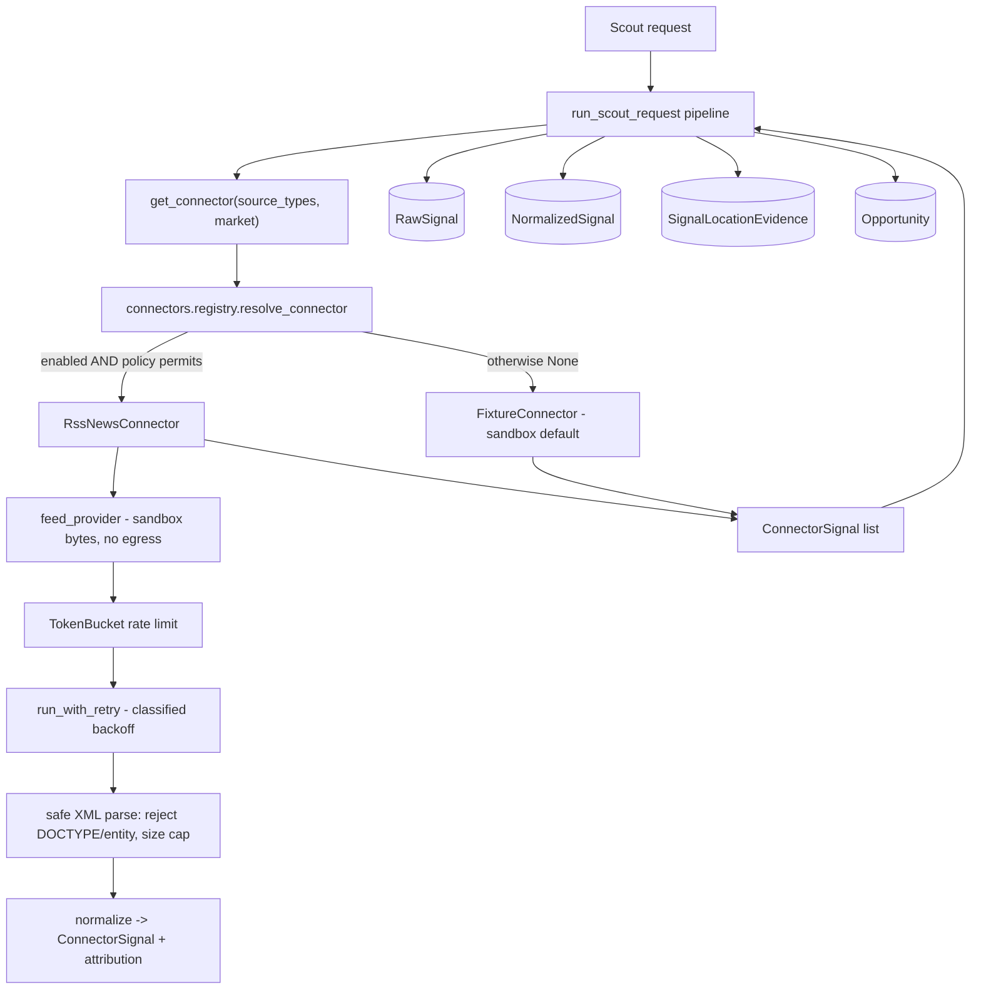

# Phase 3B — First real scouting connector: implementation plan

**Status: Batch 1 (connector foundation + RSS sandbox connector) — DRAFT for owner review.**

_Independent-review status: NO INDEPENDENT THIRD-PARTY REVIEW COMPLETED._

## 1. Executive summary

Phase 3A delivered the production data plane (PostgreSQL / Redis / S3 adapters,
durable job worker + fleet registry, observability, deployment). The scouting
pipeline is complete and production-shaped, but it still ingests **simulated
fixtures** through the `Connector` seam. Phase 3B replaces that seam's default
with the first **real** scouting connector, end to end: source connection →
ingestion → normalization → evidence storage → opportunity creation → per-location
isolation → UI display → full tests (`docs/phase-3-plan.md` Phase 3B).

This batch (Batch 1) delivers the **connector-agnostic foundation** every source
must satisfy plus the **first concrete connector (RSS / news feeds) in a
deterministic sandbox** (no live network egress). It is fully additive and inert
by default: the fixture path stays authoritative until a product owner enables a
specific connector. Live egress, feed hardening against untrusted input, and the
frontend surface are explicitly deferred to later batches, gated on owner
approval and connector legal sign-off.

## 2. Scope evidence and classification

| # | Source | What it establishes | Authority |
|---|--------|---------------------|-----------|
| E1 | `docs/phase-3-plan.md` §"Phase 3B" | "First real scouting connector / Choose **one** legally accessible, high-value connector." Deliverables: source connection, ingestion, normalization, evidence storage, opportunity creation, location isolation, UI display, full tests. "Do not begin with every social network simultaneously." | **Authoritative** |
| E2 | `docs/phase-3-plan.md` Workstream A | Per-connector non-negotiables: legal/policy review, rate limiting, credential isolation, source attribution, retry/backoff, failure classification, data-retention, jurisdiction filters, per-location isolation, mock/sandbox. Disclaims unrestricted scraping. | **Authoritative** |
| E3 | `docs/phase-3-plan.md` Phase 3 entry criteria | "Product owner approves the first Phase 3 vertical slice"; "Connector policy and legal feasibility confirmed"; acceptance criteria + data-isolation tests + rollback + cost limits. | **Authoritative** |
| E4 | `apps/api/app/scouting_requests/connectors.py` | The `Connector` seam + default `FixtureConnector` already exist; docstring anticipates live connectors. | Supporting (code) |
| E5 | `apps/api/app/core/enums.py` `SourceType` | `rss_news`, `website_scan`, `reddit`, `reviews`, `google_trends`, `meta_ad_library`, … already defined; the pipeline already handles `rss_news` items. | Supporting (code) |

**Classification: PARTIALLY DEFINED.** The phase's objective, boundaries,
deliverables, operational contract, dependencies and exclusions are DEFINED. The
one open, owner-gated parameter is **which** connector (E3). Per the Phase 3B
plan-of-record, that decision requires product-owner approval and confirmed legal
feasibility before live egress.

**Recommended first connector: RSS / news feeds (`rss_news`).** Repository-backed
rationale: named in Workstream A as a first-tier public source; `SourceType.RSS_NEWS`
already flows through the pipeline; RSS is publisher-syndicated content with
explicit intent to distribute — the lowest ToS/legal risk of the candidates,
best satisfying "legally accessible"; needs no per-user credentials; fully
deterministic to sandbox. Website crawl is second (robots/ToS complexity); social
APIs need credentials + heavier policy review.

## 3. In scope / out of scope

**In scope (Batch 1):**
- Connector foundation package `app/connectors/`: signal contract, base class,
  failure classification, token-bucket rate limiter, bounded retry/backoff,
  enablement + jurisdiction policy, registry.
- RSS/news connector: parse → normalize → source attribution, market-scoped,
  keyword-filtered, running on a bundled **deterministic sandbox feed**.
- Config flags (all off/bounded by default) and registry wiring so the connector
  is selected **only** when explicitly enabled and policy-permitted.
- Full unit tests; all existing gates preserved.

**Out of scope (later batches, owner-gated):**
- Live network egress / a real HTTP feed provider (Batch 2).
- Hardened parsing of untrusted remote feeds (e.g. `defusedxml`, per-host
  allowlists, content-type/size enforcement on live responses) (Batch 2).
- Persisted per-connector run metadata / cost accounting surfaced to operators.
- Frontend display of connector source + attribution on opportunities (Batch 3).
- Any second connector (Reddit, reviews, website crawl, …).

## 4. Current-state assessment

| Component | State | Batch-1 action |
|-----------|-------|----------------|
| `Connector` Protocol + `FixtureConnector` | Exists; simulated only | Reuse; resolve via registry; fixture stays default |
| Pipeline `run_scout_request` (`app/jobs/pipeline.py`) | Production-ready; per-tenant/location scoped | Reuse; pass scope to `get_connector`; default path unchanged |
| `RawSignal` / `NormalizedSignal` / `SignalLocationEvidence` | Production-ready evidence storage | Reuse; no schema change in Batch 1 |
| Connector operational contract (rate limit, retry, failure class., attribution, sandbox) | **Missing** | Build `app/connectors/` |
| `SourceType` vocabulary incl. `rss_news` | Exists end-to-end | Reuse |
| Live egress | `httpx` present; unused by connectors | Not wired (owner-gated) |

## 5. Architecture

The connector is a drop-in at the existing seam: `get_connector` returns a live
connector only when enabled + permitted, else the fixture connector. The pipeline
downstream is unchanged.

## 6. Data model

No schema change in Batch 1. Connector output normalizes into the existing
`raw_signals` / `normalized_signals` / `signal_location_evidence` tables via the
unchanged pipeline. `ConnectorSignal.attribution` (connector name, source title,
source URL, retrieved-at, license) is carried in the signal and lands in existing
`raw_metadata` / `ingest_metadata` JSON when a live connector is enabled — no
migration required. A dedicated attribution/run table, if wanted, is a later
batch.

## 7. API and contract

No new endpoints or schemas; `apps/api/openapi.json` and the generated frontend
types are unchanged (verified: zero contract drift). Connector selection is
internal to the pipeline and governed by configuration, not request input.

## 8. Frontend

No change in Batch 1. Displaying connector source + attribution on opportunity
detail is Batch 3, behind the generated contract.

## 9. Worker

No change to durable job execution. The connector runs inside the existing
`run_scout_request` job body, so at-least-once delivery, idempotency, leasing and
isolation guarantees carry over unchanged. The rate limiter/retry are per-run and
in-process; no new background thread.

## 10. Security and privacy

- **Off by default.** `connector_rss_enabled=False`; a live source never runs
  implicitly. Enabling is a bounded, validated config decision.
- **Isolation preserved.** A connector receives only a `FetchScope` (market,
  keywords, source types, cap) and must return in-market signals; the pipeline's
  tenant/workspace/location guards are unchanged. Market isolation is unit-tested.
- **No secret leakage.** Connectors carry no credentials in Batch 1; attribution
  stores only non-secret provenance. Failures are classified into a coarse,
  secret-free taxonomy — no raw driver/parse text is surfaced.
- **XML safety.** The parser rejects any feed declaring a DOCTYPE/entity
  (defusing billion-laughs / XXE) and caps input size before parsing.
- **No fabricated commercial signal.** Fields a public source cannot observe
  (engagement, buying intent, ad activity) default to neutral.
- **Nothing simulated presented as real.** Sandbox signals keep `is_simulated=True`.

## 11. Testing

`app/tests/test_connectors.py` (25 tests, all offline): rate-limiter token math
+ refill; retry backoff bounds, retry-only-transient, give-up-at-cap; failure
classification; policy enablement + jurisdiction; RSS parse/normalize/attribution;
**market isolation**; keyword filter; DOCTYPE/malformed/size rejection; network +
rate-limit classification; registry enable/disable/jurisdiction; seam default →
fixture and enabled → live; and a contract test locking every pipeline-read
attribute on `ConnectorSignal`. All prior suites, ruff, migration check, contract
drift, npm audit, frontend gates and the four-market smoke remain green.

## 12. Rollout

Additive and inert. No migration. To trial the live path later: set
`connector_rss_enabled=true` (optionally `connector_rss_markets`) in a non-prod
environment **after** a live feed provider lands in Batch 2 and legal feasibility
is confirmed. **Rollback:** set the flag back to false (instant revert to the
fixture path) or revert the branch — no schema or data changes to undo.

## 13. Batch plan

- **Batch 1 (this PR):** connector foundation + RSS sandbox connector + tests. No
  egress, no UI, no migration. Draft PR = owner checkpoint for connector choice +
  legal feasibility.
- **Batch 2:** live HTTP feed provider behind config; hardened untrusted-feed
  parsing; per-host allowlist + cost/rate ceilings; integration smoke against a
  local sandbox feed server; run/attribution persistence.
- **Batch 3:** frontend surface for connector source + attribution on opportunities.
- **Later:** additional connectors (one at a time), each with its own policy/legal
  review.

## 14. Acceptance criteria (Batch 1)

1. Connector foundation exists with rate limiting, bounded retry/backoff, failure
   classification, enablement + jurisdiction policy, and a registry. ✅
2. RSS connector parses → normalizes → attributes a feed, market-scoped, offline. ✅
3. Default behaviour is byte-identical (fixture path); four-market smoke unchanged. ✅
4. No live egress; XML parsing rejects DOCTYPE/entity + oversize input. ✅
5. No schema change, no contract drift, no new API surface. ✅
6. All gates green: backend + new tests, ruff, migration check, contract gen,
   npm audit, frontend lint/type-check/tests, integration smoke. ✅

## 15. Risk register

| ID | Risk | Likelihood | Impact | Mitigation | Disposition |
|----|------|-----------|--------|------------|-------------|
| B-1 | Connector choice not yet owner-approved | — | Med | Batch 1 ships only the foundation + sandbox; live egress deferred to Batch 2 behind approval; draft PR is the checkpoint | Open — needs owner sign-off |
| B-2 | Live feed parsing of untrusted input could enable XXE/billion-laughs | Low | High | DOCTYPE/entity rejection + size cap now; `defusedxml` + hardening planned for Batch 2 before any egress | Mitigated (Batch 1) / Deferred (Batch 2) |
| B-3 | A connector could blend markets | Low | High | Connector receives only a scoped `FetchScope`; market isolation unit-tested; pipeline guards unchanged | Mitigated |
| B-4 | Enabling a live source without rate control → source abuse / cost | Low | Med | Token-bucket rate limit + bounded retry mandatory; flags validated at construction; live provider gated | Mitigated |
| B-5 | Fabricated commercial signal from a public source | Low | Med | Neutral defaults for unobservable fields; `is_simulated` honoured | Mitigated |
| B-6 | Regression to the existing fixture pipeline | Low | High | Additive; default path unchanged; full suite + smoke green | Mitigated |
| B-7 | Legal/ToS feasibility of RSS not formally confirmed | — | Med | Recommendation documented; formal confirmation is a Phase 3 entry criterion owned by the product owner | Open — needs legal sign-off |

## Batch 2 — Controlled live RSS/news ingestion

**Status: BLOCKED — OWNER OR LEGAL DECISION REQUIRED.**

_Independent-review status: NO INDEPENDENT THIRD-PARTY REVIEW COMPLETED._

### Objective

Deliver the **safety machinery** required to make a *controlled, allowlist-only*
live RSS/news fetch possible — a hardened outbound HTTP boundary (SSRF/DNS/redirect
defenses, size/timeout/media-type limits), a typed approved-source registry, feed
state + deduplication, untrusted-content isolation, fail-closed feature flags, a
kill switch and bounded observability — **without turning on any live network
egress**. Real egress remains gated on the two unmet Phase 3 entry criteria
(`docs/phase-3-plan.md` lines 222–223). The exact outcome of this batch: everything
needed to enable live RSS *except the act of enabling it* is built, tested offline,
and documented, so enabling later is a small, auditable, reversible config change
made only after owner + legal sign-off.

### Entry criteria

| # | Prerequisite (`docs/phase-3-plan.md` §"Phase 3 entry criteria") | State |
|---|------------------------------------------------------------------|-------|
| 1 | Product owner approves the first Phase 3 vertical slice (RSS live) | **UNSATISFIED — BLOCKING** (checkbox unchecked; no approval record) |
| 2 | Connector policy **and legal feasibility** confirmed | **UNSATISFIED — BLOCKING** (no legal/ToS review or documented risk acceptance) |
| 3 | Approved initial source(s) with usage rights | **UNSATISFIED — BLOCKING** (registry ships empty / all-disabled) |
| 4 | Approved initial jurisdiction(s) | **UNSATISFIED — BLOCKING** (none approved) |
| 5 | Approved rollout population (tenant/workspace/canary) | **UNSATISFIED — BLOCKING** (none approved) |
| 6 | Rollback plan defined | **SATISFIED** (default-off flag + kill switch + branch revert; documented below) |
| 7 | Cost limits defined | **DEFERRED WITH ACCEPTANCE** (per-source burst/daily caps modeled in registry; concrete values set at enablement) |
| 8 | Data-isolation tests defined | **SATISFIED** (tenant/workspace/location/market/jurisdiction isolation tests added, offline) |

Because prerequisites 1–5 are **BLOCKING and unsatisfied**, this batch implements
only the safety foundation and **does not send live traffic**. See §"Owner
decisions still required".

### In scope (this batch — no egress)

- **Approved-source registry** (`app/connectors/sources.py`): typed, immutable
  source records with enablement, environment/tenant/workspace/market eligibility,
  jurisdiction allowlist, rate/size/retention limits, attribution requirements and
  **legal-review + owner-approval state**. Ships **empty / all-disabled**.
- **Safe fetch boundary** (`app/connectors/safefetch.py`): URL validation
  (https-only, host/port allowlist, no credentials, no raw-IP, reject
  loopback/private/link-local/multicast/reserved/metadata), IP-address safety
  classification (IPv4 + IPv6), DNS-resolution guard (every resolved address must
  be public; re-validate after redirects → DNS-rebinding defense), redirect guard
  (bounded hops, per-hop re-validation, no scheme downgrade, no cross-host to an
  unapproved host, no private-IP target), and network limits (connect/read/total
  timeout, response-size cap, bounded decompression, media-type check). A
  `SafeFeedClient` drives these through an **injectable transport**; the only
  transport available under default config is a **fail-closed** one that refuses
  because live egress is disabled. **No real-egress transport is implemented.**
- **Feed state + deduplication** (`app/connectors/feedstate.py`): minimal
  in-memory state (last fetch, ETag, Last-Modified, fingerprint, failure count,
  backoff-until) and a correctly-scoped dedup key
  (source + tenant/workspace + location + market + item id + normalized URL/
  fingerprint) so a duplicate in one market never suppresses another market's item.
- **Untrusted-content isolation** (`app/connectors/content.py`): treat all feed
  text as untrusted — length cap, HTML→text stripping, prompt-injection
  neutralization (no instruction execution, quoted-content separation, provenance
  labeling), URL safety screening.
- **Fail-closed feature flags** (config): global live flag, per-source flag,
  tenant/workspace allowlist, jurisdiction allowlist, canary list, max active
  sources, max concurrency, **kill switch** — all default off/empty; malformed or
  missing config **fails closed** to the fixture path.
- **Bounded observability**: connector metric names + coarse, secret-free error
  categories routed through the existing bounded-cardinality metrics seam.
- **Offline security tests** (`app/tests/test_live_connector_safety.py`): SSRF/URL,
  DNS, redirect, HTTP-limit, feed, isolation, content and config-fail-closed
  coverage using fake DNS + fake transports. **No real network in CI.**

### Out of scope (explicit)

General crawling · HTML article scraping · paywall/auth/CAPTCHA/robots
circumvention · authenticated platform scraping · social-network connectors
(Reddit/Meta/TikTok/LinkedIn/X/YouTube/podcasts) · automated posting · ad/creative
generation · billing/metering · customer-facing connector-setup UI · **Batch 3
(frontend attribution surface)** · **the act of enabling real egress** · any second
connector · arbitrary customer-defined URLs · a DB migration (persistence deferred
until the authoritative design requires it and approval lands).

### Source policy

Allowlist-only: a fetch is permitted **only** for an explicitly approved source
whose canonical scheme+host and exact feed URL/paths match, whose enablement flag
is on, and whose jurisdiction allowlist admits the request's market. Sources are
**disabled by default** and carry explicit `legal_review` and `owner_approval`
state; a source missing either **cannot activate** regardless of flags. Attribution
(source title, URL, license, retrieved-at) is mandatory; content retention is capped
to metadata/excerpt (no full-article persistence). Revocation = flip the source's
enabled flag / remove it → immediate stop. Full schema in
`docs/phase-3b/rss-source-policy.md`.

### Threat model (summary)

SSRF, DNS rebinding, open redirects, redirect-to-private-network, oversized
responses, decompression bombs, XML entity/DOCTYPE attacks, slow-loris/connection
exhaustion, malicious feed content, **prompt injection inside feed text**, unsafe
URLs in entries, duplicate/replayed content, cross-market contamination, source
impersonation, poisoned feeds, log injection, secret leakage, retry storms,
high-cardinality telemetry. Controls and residual risks in
`docs/security/live-connector-threat-model.md`.

### Rollout and rollback

- **Default-off** global flag (`connector_rss_live_enabled=false`) + **kill switch**
  (`connector_rss_kill_switch`) that overrides all activation.
- **Source-level** enablement + **tenant/workspace** and **jurisdiction** allowlists
  + **canary** list; `connector_rss_live_max_active_sources` and
  `connector_rss_live_max_concurrency` bound blast radius.
- Fetch frequency / daily fetches bounded **per source** in the registry.
- **Rollback:** set `connector_rss_live_enabled=false` (or trip the kill switch) for
  an instant revert to the fixture path; or revert the branch. No schema/data to
  undo (no migration).
- Metrics/alerts: validation-rejection rate, DNS/redirect rejections, timeout rate,
  source health, breaker state — thresholds in
  `docs/operations/rss-connector-operations.md`.

### Owner decisions still required (before any live egress)

1. **Product-owner approval** that RSS/news is the approved first live connector.
2. **Legal/ToS feasibility** confirmed, or a documented internal risk acceptance.
3. **Specific approved source(s)** with recorded usage rights/attribution/retention.
4. **Approved jurisdiction(s)** for initial live traffic.
5. **Approved rollout population** (which tenants/workspaces, canary size).
6. **Concrete cost ceilings** (per-source burst/daily fetch caps).

Until all six are documented, the registry stays empty/all-disabled and
`connector_rss_live_enabled` stays false; the connector cannot open a socket.

### Acceptance criteria (Batch 2, safety-foundation scope)

1. Safe fetch boundary rejects every unsafe URL/DNS/redirect class (tested offline). ✅
2. Approved-source registry is typed, empty/all-disabled, and cannot activate a
   source lacking legal + owner approval. ✅
3. Live egress is impossible under default config — no real-egress transport exists;
   default path is byte-identical to the fixture pipeline. ✅
4. Untrusted feed text is isolated from downstream AI (no instruction execution). ✅
5. Feature flags fail closed; kill switch overrides all activation. ✅
6. No migration, no contract drift, no new API surface. ✅
7. All existing gates + new safety tests green; four-market smoke unchanged. ✅
