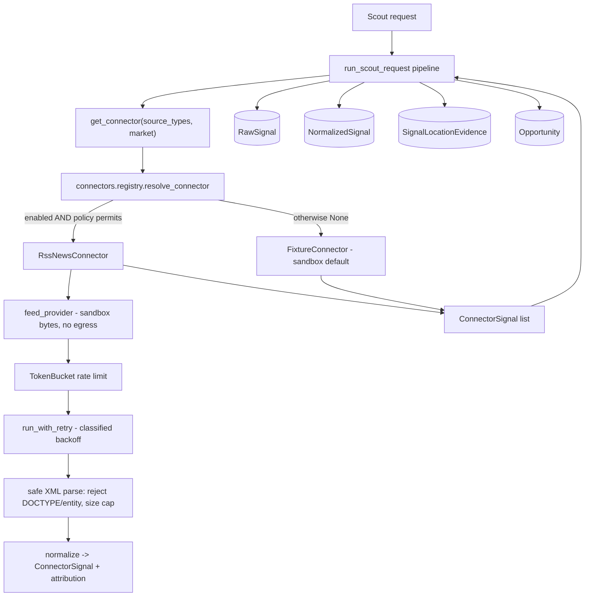

# Phase 3B — First real scouting connector: implementation plan

**Status: Batch 1 (connector foundation + RSS sandbox connector) — DRAFT for owner review.**

_Independent-review status: NO INDEPENDENT THIRD-PARTY REVIEW COMPLETED._

## 1. Executive summary

Phase 3A delivered the production data plane (PostgreSQL / Redis / S3 adapters,
durable job worker + fleet registry, observability, deployment). The scouting
pipeline is complete and production-shaped, but it still ingests **simulated
fixtures** through the `Connector` seam. Phase 3B replaces that seam's default
with the first **real** scouting connector, end to end: source connection →
ingestion → normalization → evidence storage → opportunity creation → per-location
isolation → UI display → full tests (`docs/phase-3-plan.md` Phase 3B).

This batch (Batch 1) delivers the **connector-agnostic foundation** every source
must satisfy plus the **first concrete connector (RSS / news feeds) in a
deterministic sandbox** (no live network egress). It is fully additive and inert
by default: the fixture path stays authoritative until a product owner enables a
specific connector. Live egress, feed hardening against untrusted input, and the
frontend surface are explicitly deferred to later batches, gated on owner
approval and connector legal sign-off.

## 2. Scope evidence and classification

| # | Source | What it establishes | Authority |
|---|--------|---------------------|-----------|
| E1 | `docs/phase-3-plan.md` §"Phase 3B" | "First real scouting connector / Choose **one** legally accessible, high-value connector." Deliverables: source connection, ingestion, normalization, evidence storage, opportunity creation, location isolation, UI display, full tests. "Do not begin with every social network simultaneously." | **Authoritative** |
| E2 | `docs/phase-3-plan.md` Workstream A | Per-connector non-negotiables: legal/policy review, rate limiting, credential isolation, source attribution, retry/backoff, failure classification, data-retention, jurisdiction filters, per-location isolation, mock/sandbox. Disclaims unrestricted scraping. | **Authoritative** |
| E3 | `docs/phase-3-plan.md` Phase 3 entry criteria | "Product owner approves the first Phase 3 vertical slice"; "Connector policy and legal feasibility confirmed"; acceptance criteria + data-isolation tests + rollback + cost limits. | **Authoritative** |
| E4 | `apps/api/app/scouting_requests/connectors.py` | The `Connector` seam + default `FixtureConnector` already exist; docstring anticipates live connectors. | Supporting (code) |
| E5 | `apps/api/app/core/enums.py` `SourceType` | `rss_news`, `website_scan`, `reddit`, `reviews`, `google_trends`, `meta_ad_library`, … already defined; the pipeline already handles `rss_news` items. | Supporting (code) |

**Classification: PARTIALLY DEFINED.** The phase's objective, boundaries,
deliverables, operational contract, dependencies and exclusions are DEFINED. The
one open, owner-gated parameter is **which** connector (E3). Per the Phase 3B
plan-of-record, that decision requires product-owner approval and confirmed legal
feasibility before live egress.

**Recommended first connector: RSS / news feeds (`rss_news`).** Repository-backed
rationale: named in Workstream A as a first-tier public source; `SourceType.RSS_NEWS`
already flows through the pipeline; RSS is publisher-syndicated content with
explicit intent to distribute — the lowest ToS/legal risk of the candidates,
best satisfying "legally accessible"; needs no per-user credentials; fully
deterministic to sandbox. Website crawl is second (robots/ToS complexity); social
APIs need credentials + heavier policy review.

## 3. In scope / out of scope

**In scope (Batch 1):**
- Connector foundation package `app/connectors/`: signal contract, base class,
  failure classification, token-bucket rate limiter, bounded retry/backoff,
  enablement + jurisdiction policy, registry.
- RSS/news connector: parse → normalize → source attribution, market-scoped,
  keyword-filtered, running on a bundled **deterministic sandbox feed**.
- Config flags (all off/bounded by default) and registry wiring so the connector
  is selected **only** when explicitly enabled and policy-permitted.
- Full unit tests; all existing gates preserved.

**Out of scope (later batches, owner-gated):**
- Live network egress / a real HTTP feed provider (Batch 2).
- Hardened parsing of untrusted remote feeds (e.g. `defusedxml`, per-host
  allowlists, content-type/size enforcement on live responses) (Batch 2).
- Persisted per-connector run metadata / cost accounting surfaced to operators.
- Frontend display of connector source + attribution on opportunities (Batch 3).
- Any second connector (Reddit, reviews, website crawl, …).

## 4. Current-state assessment

| Component | State | Batch-1 action |
|-----------|-------|----------------|
| `Connector` Protocol + `FixtureConnector` | Exists; simulated only | Reuse; resolve via registry; fixture stays default |
| Pipeline `run_scout_request` (`app/jobs/pipeline.py`) | Production-ready; per-tenant/location scoped | Reuse; pass scope to `get_connector`; default path unchanged |
| `RawSignal` / `NormalizedSignal` / `SignalLocationEvidence` | Production-ready evidence storage | Reuse; no schema change in Batch 1 |
| Connector operational contract (rate limit, retry, failure class., attribution, sandbox) | **Missing** | Build `app/connectors/` |
| `SourceType` vocabulary incl. `rss_news` | Exists end-to-end | Reuse |
| Live egress | `httpx` present; unused by connectors | Not wired (owner-gated) |

## 5. Architecture



The connector is a drop-in at the existing seam: `get_connector` returns a live
connector only when enabled + permitted, else the fixture connector. The pipeline
downstream is unchanged.

## 6. Data model

No schema change in Batch 1. Connector output normalizes into the existing
`raw_signals` / `normalized_signals` / `signal_location_evidence` tables via the
unchanged pipeline. `ConnectorSignal.attribution` (connector name, source title,
source URL, retrieved-at, license) is carried in the signal and lands in existing
`raw_metadata` / `ingest_metadata` JSON when a live connector is enabled — no
migration required. A dedicated attribution/run table, if wanted, is a later
batch.

## 7. API and contract

No new endpoints or schemas; `apps/api/openapi.json` and the generated frontend
types are unchanged (verified: zero contract drift). Connector selection is
internal to the pipeline and governed by configuration, not request input.

## 8. Frontend

No change in Batch 1. Displaying connector source + attribution on opportunity
detail is Batch 3, behind the generated contract.

## 9. Worker

No change to durable job execution. The connector runs inside the existing
`run_scout_request` job body, so at-least-once delivery, idempotency, leasing and
isolation guarantees carry over unchanged. The rate limiter/retry are per-run and
in-process; no new background thread.

## 10. Security and privacy

- **Off by default.** `connector_rss_enabled=False`; a live source never runs
  implicitly. Enabling is a bounded, validated config decision.
- **Isolation preserved.** A connector receives only a `FetchScope` (market,
  keywords, source types, cap) and must return in-market signals; the pipeline's
  tenant/workspace/location guards are unchanged. Market isolation is unit-tested.
- **No secret leakage.** Connectors carry no credentials in Batch 1; attribution
  stores only non-secret provenance. Failures are classified into a coarse,
  secret-free taxonomy — no raw driver/parse text is surfaced.
- **XML safety.** The parser rejects any feed declaring a DOCTYPE/entity
  (defusing billion-laughs / XXE) and caps input size before parsing.
- **No fabricated commercial signal.** Fields a public source cannot observe
  (engagement, buying intent, ad activity) default to neutral.
- **Nothing simulated presented as real.** Sandbox signals keep `is_simulated=True`.

## 11. Testing

`app/tests/test_connectors.py` (25 tests, all offline): rate-limiter token math
+ refill; retry backoff bounds, retry-only-transient, give-up-at-cap; failure
classification; policy enablement + jurisdiction; RSS parse/normalize/attribution;
**market isolation**; keyword filter; DOCTYPE/malformed/size rejection; network +
rate-limit classification; registry enable/disable/jurisdiction; seam default →
fixture and enabled → live; and a contract test locking every pipeline-read
attribute on `ConnectorSignal`. All prior suites, ruff, migration check, contract
drift, npm audit, frontend gates and the four-market smoke remain green.

## 12. Rollout

Additive and inert. No migration. To trial the live path later: set
`connector_rss_enabled=true` (optionally `connector_rss_markets`) in a non-prod
environment **after** a live feed provider lands in Batch 2 and legal feasibility
is confirmed. **Rollback:** set the flag back to false (instant revert to the
fixture path) or revert the branch — no schema or data changes to undo.

## 13. Batch plan

- **Batch 1 (this PR):** connector foundation + RSS sandbox connector + tests. No
  egress, no UI, no migration. Draft PR = owner checkpoint for connector choice +
  legal feasibility.
- **Batch 2:** live HTTP feed provider behind config; hardened untrusted-feed
  parsing; per-host allowlist + cost/rate ceilings; integration smoke against a
  local sandbox feed server; run/attribution persistence.
- **Batch 3 (signal intelligence — this section 16):** additive, fully deterministic,
  offline signal-intelligence core (extraction → business relevance → versioned
  opportunity scoring → structured accept/reject) reusing the existing scoring
  engines. Orthogonal to the connector-attribution *frontend* work, which remains a
  later, separately-gated UI batch.
- **Later:** additional connectors (one at a time), each with its own policy/legal
  review; frontend surface for connector source + attribution on opportunities.

## 14. Acceptance criteria (Batch 1)

1. Connector foundation exists with rate limiting, bounded retry/backoff, failure
   classification, enablement + jurisdiction policy, and a registry. ✅
2. RSS connector parses → normalizes → attributes a feed, market-scoped, offline. ✅
3. Default behaviour is byte-identical (fixture path); four-market smoke unchanged. ✅
4. No live egress; XML parsing rejects DOCTYPE/entity + oversize input. ✅
5. No schema change, no contract drift, no new API surface. ✅
6. All gates green: backend + new tests, ruff, migration check, contract gen,
   npm audit, frontend lint/type-check/tests, integration smoke. ✅

## 15. Risk register

| ID | Risk | Likelihood | Impact | Mitigation | Disposition |
|----|------|-----------|--------|------------|-------------|
| B-1 | Connector choice not yet owner-approved | — | Med | Batch 1 ships only the foundation + sandbox; live egress deferred to Batch 2 behind approval; draft PR is the checkpoint | Open — needs owner sign-off |
| B-2 | Live feed parsing of untrusted input could enable XXE/billion-laughs | Low | High | DOCTYPE/entity rejection + size cap now; `defusedxml` + hardening planned for Batch 2 before any egress | Mitigated (Batch 1) / Deferred (Batch 2) |
| B-3 | A connector could blend markets | Low | High | Connector receives only a scoped `FetchScope`; market isolation unit-tested; pipeline guards unchanged | Mitigated |
| B-4 | Enabling a live source without rate control → source abuse / cost | Low | Med | Token-bucket rate limit + bounded retry mandatory; flags validated at construction; live provider gated | Mitigated |
| B-5 | Fabricated commercial signal from a public source | Low | Med | Neutral defaults for unobservable fields; `is_simulated` honoured | Mitigated |
| B-6 | Regression to the existing fixture pipeline | Low | High | Additive; default path unchanged; full suite + smoke green | Mitigated |
| B-7 | Legal/ToS feasibility of RSS not formally confirmed | — | Med | Recommendation documented; formal confirmation is a Phase 3 entry criterion owned by the product owner | Open — needs legal sign-off |

## 16. Batch 3 — Signal intelligence and opportunity scoring

**Status: Batch 3 (signal-intelligence core) — DRAFT.** Additive to the Phase 2
pipeline; no schema change, no contract change, no live egress, no dependency on
the Batch 2 live-connector branch (PR #34).

_Independent-review status: NO INDEPENDENT THIRD-PARTY REVIEW COMPLETED._

### 16.1 Classification: PARTIALLY DEFINED

A rich Phase 2 pipeline already scores opportunities (`app/jobs/pipeline.py` +
`app/scoring/*`). What is **not** yet defined is a deterministic, offline
*intelligence layer* that (a) separates observed **facts** from **inference**
with evidence spans, (b) versions its scoring, (c) emits **structured** accept/
reject reason codes, and (d) runs with **no** model call. Per the plan-of-record
rule "implement only the supported foundation; do not invent an unrelated Batch 3",
this section adds exactly that foundation and reuses — never replaces — the
existing relevance/validation/decision engines.

### 16.2 Objective

Transform a normalized, market-scoped signal into an explainable, evidence-backed
`OpportunityCandidate` through a deterministic chain:
`enrich → extract facts + intelligence → business relevance → versioned scoring →
structured accept/reject → deterministic clustering`. Identical input always
produces identical output; no untrusted content is ever executed or trusted.

### 16.3 What exists / is missing

| Concern | Phase 2 today | Batch 3 addition |
|---------|---------------|------------------|
| Signal typing | LLM-only (`classify_signal`) | Deterministic, offline extractor (no model call) |
| Facts vs inference | Mixed on `Opportunity` | Typed `SignalFacts` (literal) vs `ExtractedIntelligence` (inference + evidence spans + method + confidence) |
| Scoring version | none | `SCORING_VERSION` stamp on every breakdown |
| Rejections | silent `continue` | `RejectionReason` enum + structured, explainable reasons |
| Enrichment provider | n/a | Provider-neutral boundary: deterministic default, AI adapter **disabled**, offline in tests |
| Clustering | empty `app/clustering/` | Deterministic key-based clustering with stable ids |
| Evaluation | none | Labeled dataset with expected outcomes, asserted in tests |

### 16.4 Domain models (`app/intelligence/models.py`)

- `SignalFacts` — only what is literally present (source_type, market, author,
  language, published_days_ago, char/word counts, raw excerpt). No inference.
- `EvidenceSpan` — `(start, end, quote)` into the *sanitized* excerpt, plus the
  extraction `method`. Every inferred attribute references ≥1 span.
- `ExtractedIntelligence` — inferred signal_type, pain-point DNA, sentiment,
  buying-intent / competitor-dissatisfaction flags, each with `evidence` spans,
  `method`, and a 0..1 `confidence`. Never conflated with facts.
- `BusinessRelevance` — relevance score (reuses `score_relevance`), matched
  keyword/pain/audience/competitor hits, exclusion hits, `below_action_floor`.
- `OpportunityCandidate` — the batch's output: facts, intelligence, relevance,
  the versioned `IntelligenceScore`, the `decision` (accept) or `RejectionReason`
  (reject), a human rationale, and the cluster key. Carries `is_simulated`.

### 16.5 Provider-neutral enrichment boundary (`app/intelligence/enrichment.py`)

An `Enricher` protocol with two implementations: `DeterministicEnricher`
(default; pure functions, offline) and a disabled `ModelEnricher` stub that
**raises** unless an explicit, non-default, non-test opt-in is set — so no
customer/source text can reach an external model in normal operation or CI.
Selection mirrors the LLM-service pattern (config-driven, safe default).

### 16.6 Deterministic extraction (`app/intelligence/extraction.py`)

Keyword/lexicon and regex matchers over the **sanitized** excerpt. Untrusted-
content safety: prompt-injection markers are defanged (quoted, never obeyed) and
control characters stripped before any span is recorded — identical to the Batch 2
neutralization discipline but applied to extracted quotes. No `eval`, no network,
no model.

### 16.7 Versioned scoring (`app/intelligence/scoring.py`)

`SCORING_VERSION = "3b.1"`. Composite 0..100 from eight clamped factors, each
carried with `{weight, value, points}`:

| Factor | Weight |
|--------|-------:|
| source_quality | 15 |
| recency | 10 |
| evidence_strength | 20 |
| urgency | 10 |
| business_fit | 20 |
| market_fit | 10 |
| commercial_usefulness | 10 |
| confidence | 5 |

Inputs reuse `_SOURCE_CREDIBILITY`, the relevance action-floor (40), cross-source
`score_validation`, and geo in-area. The breakdown embeds `version` so a stored
score is always interpretable against the formula that produced it.

### 16.8 Rejection / suppression (`app/intelligence/rejection.py`)

`RejectionReason` (new enum, additive): `NOISE`, `OUT_OF_CONTEXT`, `OUT_OF_MARKET`,
`DUPLICATE`, `INSUFFICIENT_EVIDENCE`, `POLICY_BLOCKED`, `WEAK_SIGNAL`. Rules are
ordered and short-circuit; each returns a structured reason + rationale so a
suppressed signal is as explainable as an accepted one.

### 16.9 Deterministic clustering (`app/intelligence/clustering.py`)

Stable cluster key = pain-point DNA → else signal type → else `"general"`, with a
deterministic content-hash tiebreak. No embeddings, no randomness; the same set
of candidates always clusters identically.

### 16.10 Migration / API / frontend / pipeline

- **Migration: NONE.** Pure/in-memory; results ride existing `ingest_metadata`
  JSON. A dedicated `signal_intelligence` table is a documented deferred decision.
- **API: no contract change.** No route/schema edits; `openapi.json` untouched.
- **Frontend: none.** Deferred.
- **Pipeline: additive only.** `analyze_signal` is attached to
  `NormalizedSignal.ingest_metadata["intelligence"]` behind a default-safe call;
  existing outputs, scores and decisions are byte-identical. If any existing test
  would change, the wiring is withheld and the core ships standalone.

### 16.11 Testing + evaluation

`app/tests/test_signal_intelligence.py` (unit: facts/inference separation,
extraction determinism, injection defanging, versioned scoring bounds + factor
math, every rejection reason, clustering stability) and
`app/tests/test_intelligence_evaluation.py` (asserts the labeled dataset in
`app/intelligence/evaluation/` reproduces expected accept/reject + band exactly).
All prior suites, ruff, migration check, contract drift, npm audit, frontend gates
and the four-market smoke stay green.

### 16.12 Rollback

`main` @ `fe78b39`. Every commit additive; no migration, no contract change —
reverting the branch (or simply not merging the draft PR) fully restores current
behavior.

## 17. Batch 4 — Evidence-backed opportunity intelligence

### 17.1 Status

**Status:** OWNER SCOPE CONFIRMED — READY FOR IMPLEMENTATION PLANNING

- The product scope is **approved** by the product owner.
- Code implementation **has not started**; this section is the implementation
  contract for Batch 4, not a record of completed work.
- Batch 4 is **independent of PR #34 and live egress** — neither the live-connector
  branch nor any network transport is a dependency. Batch 4 reads intelligence that
  the existing (simulated) deterministic pipeline already produces.

> Note on numbering: this "Phase 3B Batch 4" is distinct from the already-delivered
> "Phase 3A.4b Batch 4" (production containers/lifecycle). They share a digit only.

### 17.2 Objective

Persist the deterministic Batch 3 intelligence result as a first-class,
workspace-scoped and opportunity-linked record; expose it through a
backward-compatible read-only opportunity-detail API field; and render an
evidence-backed intelligence panel in the **existing** opportunity-detail
experience.

The customer-facing result must answer:

- What did SignalNest find?
- What source facts support it?
- What did SignalNest infer?
- Why does it match this business and market?
- What scoring components contributed to the result?
- Which intelligence and scoring versions produced it?
- What source and attribution information is available?

This is a **read-first visibility and traceability** batch — not a recommendation,
generation, feedback-learning, or publishing batch.

### 17.3 Current architecture and gap

**Existing capabilities (already on `main`):**

- Opportunity feed API (`GET /workspaces/{id}/opportunities`, filtered/sorted/scoped).
- Opportunity-detail API (`GET .../opportunities/{id}`, with score breakdowns + evidence).
- Status update flow (`PUT .../opportunities/{id}/status`, audited).
- Opportunity list UI (`apps/web/src/pages/Opportunities.tsx`).
- Opportunity-detail UI (`apps/web/src/pages/OpportunityDetail.tsx`).
- Existing score (`opportunity_scores`) and `validation_evidence`.
- Workspace and location scoping on every query.
- Deterministic Batch 3 analysis (`app/intelligence/`), scoring version `3b.1`.
- Fact-versus-inference types (`SignalFacts` vs `ExtractedIntelligence`).

**The missing bridge:**

- Batch 3 intelligence is **not first-class persisted data** — it rides only inside
  `normalized_signals.ingest_metadata["intelligence"]` JSON.
- **No opportunity API schema exposes it.**
- **No frontend component renders it.**
- Provenance and evidence spans are **not visible to customers**.
- The UI cannot presently explain the Batch 3 component score.

Batch 4 **extends the existing opportunity workspace rather than rebuilding it.**

### 17.4 Architectural boundary

```
Normalized signal
  → deterministic Batch 3 intelligence analysis
    → persisted intelligence record
      → opportunity association
        → read-only opportunity-detail API
          → evidence-backed frontend panel
```

- No network call.
- No external model.
- No dependency on PR #34.
- No generalized connector work.
- No intelligence result may trigger an external action.
- Frontend rendering is inert and text-only.
- Existing opportunity decisions remain authoritative unless a later approved phase
  changes them.

### 17.5 In scope

1. First-class persistence for Batch 3 intelligence.
2. Workspace, business, location, market, jurisdiction, signal, and opportunity
   linkage as supported by existing models.
3. Persisted scoring version (`3b.1`) and analysis version.
4. Persisted score components and composite score.
5. Persisted source facts.
6. Persisted inferred attributes.
7. Persisted evidence spans.
8. Persisted structured rejection reason where applicable.
9. Persisted provenance and simulated-source status.
10. Idempotent pipeline write or update behavior.
11. Backward-compatible opportunity-detail API expansion.
12. Evidence-backed frontend panel.
13. Visually distinct facts and inferences.
14. Source and attribution display where reliable provenance exists.
15. Loading, absent-data, unavailable-data, and error states.
16. Tenant/workspace/location/market authorization and isolation.
17. OpenAPI and frontend-client regeneration.
18. Migration lifecycle and schema-drift verification.
19. Unit, API, frontend, integration, isolation, and security tests.
20. Operational, security, and rollback documentation updates.

### 17.6 Out of scope

- Human feedback capture.
- Automatic learning from feedback.
- Ranking personalization.
- Phase 3C feedback loop.
- Recommendation generation.
- Advertisement generation.
- Image or video generation.
- Publishing or scheduling.
- Live RSS transport.
- Source approval for PR #34.
- New connectors.
- General web crawling.
- Model-backed enrichment.
- Customer connector configuration.
- Opportunity-list redesign.
- Billing.
- Team/role redesign.
- Cross-market aggregation.
- Batch 5.
- Phase 4 work.

### 17.7 Data model proposal

Propose a first-class model with a **neutral name consistent with the repository**,
such as `SignalIntelligence`, `OpportunityIntelligence`, or another name justified
by existing naming conventions. This plan **does not mandate the final name** — it is
a Batch 4A architecture-review decision.

Proposed fields:

- `id`
- `workspace_id`
- `business_id` (if supported by existing models)
- `location_id`
- `market`
- `jurisdiction`
- `scouting_request_id` (if available)
- `normalized_signal_id`
- `opportunity_id`
- `analysis_version`
- `scoring_version`
- `decision`
- `rejection_reason`
- `composite_score`
- component-score payload
- source-facts payload
- inferred-attributes payload
- evidence-spans payload
- provenance payload
- `is_simulated`
- content or analysis fingerprint
- `created_at`
- `updated_at`

Requirements:

- Proper foreign keys.
- Tenant/workspace ownership.
- Unique idempotency constraint.
- Indexes for opportunity, signal, workspace, location, market, and decision where
  justified.
- Bounded payloads.
- Backward-compatible migration.
- Downgrade support.
- No destructive alteration of existing opportunity records.

Frequently filtered values should use **typed columns**; bounded structured analysis
may use **JSON only where justified**.

### 17.8 Relationship and ownership rules

- One normalized signal may produce separate intelligence outcomes for separate
  scoped contexts.
- One opportunity may link to one **current** intelligence result per
  analysis/scoring version, or a versioned history if architecture review chooses
  history retention.
- Intelligence from one location or scouting request must **not** be reused in
  another.
- Same-topic signals in Dallas, Lagos, London, and Nairobi remain **independent**.
- No global deduplication may suppress a valid market-specific record.
- All reads must enforce workspace and location scope.
- Opportunity linkage must be **validated**, not accepted through arbitrary IDs.

**Implementation decision (resolve in Batch 4A before migration creation):**
current-only intelligence record vs. immutable version history.

### 17.9 API proposal

Additive field on the **existing opportunity-detail response** — not necessarily on
the compact feed response.

```json
{
  "intelligence": {
    "analysis_version": "3b",
    "scoring_version": "3b.1",
    "decision": "ACCEPT",
    "rejection_reason": null,
    "composite_score": 78.4,
    "components": [],
    "source_facts": [],
    "inferred_attributes": [],
    "evidence_spans": [],
    "provenance": {},
    "is_simulated": true
  }
}
```

- Exact schema must use **typed generated models**.
- Absence must be represented safely for older opportunity rows (`intelligence: null`).
- Compact feed payload remains unchanged unless a performance review approves a
  minimal summary.
- Internal policy details and unsafe raw source data must **not** be exposed.
- Response must preserve fact-versus-inference separation.
- Every opportunity read must enforce **object-level authorization**.
- Contract changes are additive but intentional.
- OpenAPI and frontend types must be regenerated and committed.

### 17.10 Frontend proposal

Extend the existing opportunity-detail page with an **intelligence panel**.

**What SignalNest found**
- bounded problem/topic summary;
- affected audience;
- decision state;
- composite score;
- confidence.

**Source evidence**
- source facts;
- evidence excerpts/spans;
- publication/source metadata;
- attribution;
- simulated-data indicator.

**SignalNest analysis**
- inferred attributes;
- business relevance;
- market relevance;
- component-score explanation;
- scoring version.

**Why this matches your business**
- relevance explanation;
- matched products/services;
- matched market/location.

**Required presentation rules:**

- Source facts and inference must be visually and semantically distinct.
- Inference cannot be styled as a quotation.
- Evidence must render as plain inert text.
- External URLs must use existing safe-link behavior.
- Missing intelligence must show an honest unavailable state.
- No fabricated explanation may be generated client-side.
- No color-only status meaning.
- Accessible headings, labels, focus behavior, and screen-reader text.
- Responsive behavior must fit the existing application design.

Do **not** redesign the full opportunity feed.

### 17.11 Acceptance criteria

**Persistence**

1. A successful Batch 3 analysis can create or update exactly one correctly scoped
   intelligence record according to the chosen versioning policy.
2. Reprocessing the same signal/context/version is idempotent and does not create
   duplicate records.
3. Existing opportunities without intelligence remain readable.
4. Existing opportunity status and score behavior remains backward compatible.
5. The migration upgrades from `a1b2c3d4e5f6`.
6. Migration downgrade and re-upgrade complete successfully.
7. Alembic reports one migration head.
8. Alembic schema-drift check reports no unintended operations.
9. Required indexes and uniqueness constraints are present.
10. No destructive data transformation is introduced.

**Facts and inference**

11. Source facts and inferred attributes use distinct persisted fields and API types.
12. Every material inference retains method, confidence, and supporting evidence
    where available.
13. Source evidence remains traceable to the normalized signal and provenance.
14. Inference is never rendered as a quoted source statement.
15. Missing evidence cannot produce a confidently presented claim.
16. Simulated fixtures remain visibly identifiable.
17. Scoring version `3b.1` is persisted and exposed for Batch 3 records.
18. Component scores remain bounded and match the persisted composite result.

**API**

19. Authorized users can retrieve intelligence through the existing
    opportunity-detail endpoint.
20. Unauthorized cross-workspace and cross-location reads are denied.
21. An opportunity ID from another workspace cannot be used to retrieve intelligence.
22. Opportunities without intelligence return a valid backward-compatible response.
23. API response schemas are typed and documented.
24. OpenAPI regeneration produces only intentional additive changes.
25. Frontend generated types match the API contract.
26. Compact opportunity-feed performance does not regress through unnecessary
    intelligence payload expansion.

**Frontend**

27. Opportunity detail displays an evidence-backed intelligence panel when
    intelligence exists.
28. Source facts and SignalNest inferences are visibly distinct.
29. Evidence, source attribution, scoring version, and component scores are displayed
    accurately.
30. Missing intelligence displays an honest unavailable or not-yet-analyzed state.
31. Rejected or weak signals display their structured decision/reason without
    exposing internal sensitive policy.
32. Simulated signals show an appropriate indicator.
33. Evidence text renders inertly with no HTML or script execution.
34. Loading, empty, error, and partial-data states are tested.
35. The panel is keyboard accessible and usable with screen readers.
36. The panel works at supported responsive breakpoints.
37. Existing opportunity status actions continue to work.

**Isolation**

38. Dallas intelligence cannot appear in Lagos opportunities.
39. Lagos intelligence cannot appear in London opportunities.
40. London intelligence cannot appear in Nairobi opportunities.
41. Separate scouting requests remain independent.
42. Separate locations of the same business remain independent.
43. Separate workspaces cannot access each other's intelligence.
44. Same-topic signals can produce independent market-specific intelligence records.
45. Reprocessing in one market cannot overwrite another market's record.

**Determinism and safety**

46. Batch 4 introduces no HTTP, socket, model API, subprocess, `eval`, or `exec` path.
47. `DeterministicEnricher` remains the active default.
48. `ModelEnricher` remains disabled and fail-closed.
49. Stored evidence is sanitized and bounded before persistence.
50. Prompt-injection markers cannot alter pipeline, persistence, API, or UI behavior.
51. Raw source text cannot modify scoring weights, policy, authorization, or
    configuration.
52. No unresolved Critical or High security finding remains.
53. Security tests cover object-level authorization, stored XSS, mass assignment,
    oversized payloads, and cross-tenant access.

**Quality gates**

54. Ruff passes.
55. Full backend test suite passes.
56. PostgreSQL-gated tests run with zero unexpected skips.
57. Frontend lint passes.
58. Frontend type-check passes.
59. Frontend tests pass.
60. `npm audit` reports zero known vulnerabilities.
61. API and worker containers build and run as non-root UID `10001`.
62. Integration smoke remains at least 13/13.
63. Dallas, Lagos, London, and Nairobi isolation passes.
64. No cross-market contamination occurs.
65. PR #34 remains unnecessary for Batch 4 tests.
66. Normal CI requires no external network access.

**Governance and scope**

67. PR #34 remains untouched.
68. PR #6 remains untouched.
69. Ruleset `18820692` remains unchanged.
70. No bypass or admin merge is used.
71. Human feedback and learning are not introduced.
72. Recommendation, generation, publishing, billing, and new connectors are not
    introduced.
73. Batch 5 is not started.
74. Rollback instructions are documented and tested where practical.

### 17.12 Security acceptance criteria

Threat checklist (unresolved Critical or High findings **block readiness**):

- broken object-level authorization;
- workspace/tenant leakage;
- location/market leakage;
- unsafe opportunity-to-intelligence linkage;
- ID enumeration;
- mass assignment;
- stored XSS;
- source HTML injection;
- unsafe external links;
- oversized JSON/evidence;
- Unicode/control-character abuse;
- prompt injection;
- log injection;
- score tampering;
- evidence tampering;
- migration rollback failure;
- duplicate/idempotency race;
- stale or partial data exposure;
- arbitrary raw error exposure.

### 17.13 Observability requirements

Bounded telemetry:

- intelligence persistence attempts;
- persistence success/failure;
- idempotent update;
- API intelligence present/absent;
- authorization denial;
- evidence rendering failure;
- version mismatch;
- migration/backfill failure;
- intelligence-panel load success/error.

Labels must **not** contain: tenant IDs, workspace IDs, opportunity IDs, signal IDs,
source text, evidence text, raw URLs, arbitrary market names, or exception messages.
Use bounded outcome, decision, version, and failure-category labels only.

### 17.14 Internal implementation split

**Batch 4A — Persistence foundation**
- finalize data-model naming;
- decide current-only vs. immutable version history;
- migration;
- ORM model;
- repository;
- pipeline write path;
- idempotency;
- isolation tests;
- rollback.

*Acceptance gate:* persistence and migration tests green; no API or frontend change
required yet; existing outputs remain backward compatible.

**Batch 4B — Read-only API exposure**
- extend opportunity-detail schema;
- enforce authorization;
- add absent-data compatibility;
- contract tests;
- OpenAPI regeneration;
- frontend type generation.

*Acceptance gate:* intentional additive contract change only; no compact-feed payload
expansion unless explicitly approved; API and authorization tests green.

**Batch 4C — Frontend intelligence panel**
- add intelligence panel to existing opportunity detail;
- facts/inference presentation;
- evidence and attribution;
- score breakdown;
- loading/empty/error states;
- accessibility;
- frontend tests.

*Acceptance gate:* polished detail experience; no full feed redesign; no human-feedback
flow.

**Batch 4D — Integration and closeout**
- deterministic end-to-end read path;
- four-market isolation;
- security review;
- container validation;
- smoke tests;
- operational docs;
- acceptance report;
- rollback verification.

*Acceptance gate:* all required CI gates green; no unresolved Critical/High finding;
Batch 5 not started.

These may ship as separate PRs if the final diff becomes too large. **Each PR must
remain independently green and backward compatible.**

### 17.15 Proposed file-change map

*Labeled **proposed** — final paths depend on Batch 4A architecture review.*

| Area | Proposed file | Change type | Purpose | Batch | Risk |
|------|---------------|-------------|---------|-------|------|
| Domain | `apps/api/app/intelligence/models.py` | modify | persistence-facing conversion or separation from pure domain models | 4A | Med |
| Persistence | `apps/api/app/intelligence/persistence.py` (or repository-consistent equivalent) | create | intelligence repository + idempotent writes | 4A | Med |
| Domain | `apps/api/app/opportunities/models.py` | modify (only if the relationship belongs here) | opportunity↔intelligence linkage | 4A | Med |
| Pipeline | `apps/api/app/jobs/pipeline.py` | modify | persist the advisory intelligence result | 4A | Med |
| Enums | `apps/api/app/core/enums.py` | modify (only if persistence/API enums require it) | decision/rejection typing | 4A | Low |
| Migration | `apps/api/alembic/versions/<revision>_add_signal_intelligence.py` | create | backward-compatible additive migration from `a1b2c3d4e5f6` | 4A | High |
| API schema | `apps/api/app/opportunities/schemas.py` | modify | additive read-only `intelligence` field on detail | 4B | Med |
| API route | `apps/api/app/opportunities/routes.py` | modify | populate intelligence on detail read with object-level authz | 4B | Med |
| API repo/service | existing opportunity service/repository file (after inspection) | modify | scoped intelligence fetch | 4B | Med |
| Authz | existing authorization helpers (reuse, do not fork) | modify (only if reuse requires it) | enforce workspace/location scope | 4B | Med |
| Contract | `apps/api/openapi.json` + `packages/shared` generated types | regenerate | additive contract + frontend types | 4B | Low |
| Frontend page | `apps/web/src/pages/OpportunityDetail.tsx` | modify | mount the intelligence panel | 4C | Med |
| Frontend component | `apps/web/src/components/OpportunityIntelligencePanel.tsx` (proposed) | create | evidence-backed panel | 4C | Med |
| Frontend client | opportunity API hooks/generated types | modify | consume additive field | 4C | Low |
| Frontend reuse | existing safe-link / evidence presentation components | reuse | inert rendering + safe links | 4C | Low |
| Tests | domain/persistence, migration, API authz, pipeline idempotency, four-market isolation, frontend panel, contract, smoke | create | full Batch 4 coverage | 4A–4D | Med |
| Docs | `docs/phase-3b-implementation-plan.md` | modify | this section + closeout | 4A–4D | Low |
| Docs | `docs/phase-3b/signal-intelligence-design.md` | modify | persistence/exposure design | 4A–4C | Low |
| Docs | `docs/security/signal-intelligence-threat-model.md` | modify | new persistence/API/UI threats | 4B–4D | Low |
| Docs | `docs/operations/signal-scoring-operations.md` | modify | operate the persisted/exposed intelligence | 4A–4D | Low |
| Docs | Batch 4 acceptance report | create (closeout only) | 4D acceptance evidence | 4D | Low |

Use exact current repository paths for the opportunity schema/route/service files
after inspection. Do **not** invent a parallel route hierarchy — the opportunity-detail
endpoint already exists.

**Files explicitly NOT to touch:**

- PR #34 branch files (live egress).
- Connector transport code.
- Approved-source registry.
- Billing.
- Publishing.
- Ad generation.
- Unrelated frontend pages.
- PR #6 branch.
- Ruleset configuration.
- Phase 3A acceptance evidence.

Avoid modifying the full opportunity-list page (unless a minimal indicator is
approved), unrelated dashboard pages, or global styling without necessity.

### 17.16 Migration strategy

- Base migration head: `a1b2c3d4e5f6`.
- Additive table/relationship only.
- No destructive column alteration.
- Nullable association where historical opportunity rows require compatibility.
- Unique idempotency constraint.
- Scoped indexes.
- Verify: upgrade; downgrade; re-upgrade; fresh-database upgrade; populated-database
  compatibility; `alembic check`; single-head verification.

**No backfill should fabricate Batch 3 intelligence for old opportunities.**
Historical rows return `intelligence: null` unless a deterministic reprocessing job is
separately approved.

### 17.17 Rollout strategy

1. Migration deployed.
2. Pipeline persistence enabled behind a default-safe internal feature flag if
   existing configuration patterns support one.
3. API field exposed as nullable.
4. Frontend panel handles null safely.
5. Deterministic fixtures enabled first.
6. Internal/staging verification.
7. Four-market canary.
8. Broader rollout only after metrics and isolation pass.

No live RSS dependency.

### 17.18 Rollback strategy

Independent rollback layers:

- frontend panel rollback;
- API-field rollback while preserving nullable compatibility;
- pipeline write-path disablement;
- migration downgrade only when data-loss implications are understood;
- feature-flag disablement;
- preserve existing opportunity experience;
- do not remove or corrupt existing Phase 2 opportunity scores;
- no dependency on PR #34.

Additive persisted intelligence may safely remain unused if UI/API rollback occurs.

### 17.19 Owner decisions resolved and remaining

**Resolved:**

- Batch 4 objective approved.
- First-class persistence preferred.
- Human feedback deferred to Phase 3C.
- PR #34 not required.
- Attribution may be displayed only from reliable existing provenance.

**Remaining architecture decisions (Batch 4A — non-blocking for documentation, must
be resolved before migration creation):**

1. Final table/model name.
2. Current-only vs. immutable version history.
3. Whether the compact opportunity feed receives a minimal intelligence indicator.
4. Whether suppressed/rejected intelligence is customer-visible or operator-only.
5. Whether an internal persistence feature flag is needed.
6. Exact retention policy for versioned intelligence records.

### 17.20 Readiness classification

**Implementation readiness:** READY TO BEGIN BATCH 4A AFTER THE REMAINING DATA-MODEL
DECISIONS ARE RECORDED.

- Product scope is approved.
- Architecture is additive.
- No live-egress dependency exists.
- Implementation must begin with **Batch 4A only**.
- Later sub-batches must not be started automatically.
- Each sub-batch requires its own verification boundary.
